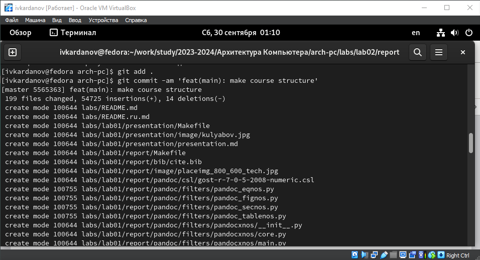

---
## Front matter

title: "Отчёт по лабораторной работе №3"
subtitle: "Дисциплина: Архитектура Компьютера"
author: "Ислам Вячеславович Карданов"

## Generic otions
lang: ru-RU
toc-title: "Содержание"

## Bibliography
bibliography: bib/cite.bib
csl: pandoc/csl/gost-r-7-0-5-2008-numeric.csl

## Pdf output format
toc: true # Table of contents
toc-depth: 2
lof: true # List of figures
fontsize: 12pt
linestretch: 1.5
papersize: a4
documentclass: scrreprt
## I18n polyglossia
polyglossia-lang:
  name: russian
  options:
	- spelling=modern
	- babelshorthands=true
polyglossia-otherlangs:
  name: english
## I18n babel
babel-lang: russian
babel-otherlangs: english
## Fonts
mainfont: PT Serif
romanfont: PT Serif
sansfont: PT Sans
monofont: PT Mono
mainfontoptions: Ligatures=TeX
romanfontoptions: Ligatures=TeX
sansfontoptions: Ligatures=TeX,Scale=MatchLowercase
monofontoptions: Scale=MatchLowercase,Scale=0.9
## Biblatex
biblatex: true
biblio-style: "gost-numeric"
biblatexoptions:
  - parentracker=true
  - backend=biber
  - hyperref=auto
  - language=auto
  - autolang=other*
  - citestyle=gost-numeric
## Pandoc-crossref LaTeX customization
figureTitle: "Рис."
tableTitle: "Таблица"
listingTitle: "Листинг"
lofTitle: "Список иллюстраций"
lolTitle: "Листинги"
## Misc options
indent: true
header-includes:
  - \usepackage{indentfirst}
  - \usepackage{float} # keep figures where there are in the text
  - \floatplacement{figure}{H} # keep figures where there are in the text
---

# Цель работы#

Целью данной работы является приобретение практического опыта работы с системой git, изучение принципов и применения контроля версий.

# Задание

1. Настройка GitHub. 

2. Базовая настройка Git. 

3. Создание SSH-ключа. 

4. Создание рабочего пространства. 

5. Создание репозитория курса на основе шаблона. 

6. Настройка каталога курса. 

7. Выполнение задания для самостоятельной работы. 

# Теоретическое введение

Системы  контроля  версий  (Version  Control  System,  VCS)  применяются  при работе нескольких человек над одним проектом. Обычно основное дерево проекта  хранится  в  локальном  или  удалённом  репозитории,  к  которому настроен  доступ  для  участников  проекта.  При  внесении  изменений  в содержание  проекта  система  контроля  версий  позволяет  их  фиксировать, совмещать  изменения,  произведённые  разными  участниками  проекта, производить откат к любой более ранней версии проекта, если это требуется. В  классических  системах  контроля  версий  используется  централизованная модель,  предполагающая  наличие  единого  репозитория  для  хранения файлов.  Выполнение  большинства  функций  по  управлению  версиями осуществляется  специальным  сервером.  Участник  проекта  перед  началом работы  посредством  определённых  команд  получает  нужную  ему  версию файлов. После внесения изменений пользователь размещает новую версию в хранилище.  При  этом  предыдущие  версии  не  удаляются  из  центрального хранилища  и  к  ним  можно  вернуться  в  любой  момент.  Сервер  может сохранять не полную версию изменённых файлов, а производить 

так называемую дельта-компрессию — сохранять только изменения между последовательными  версиями,  что  позволяет  уменьшить  объём  хранимых данных. Системы контроля версий поддерживают возможность отслеживания и разрешения конфликтов, которые могут возникнуть при работе нескольких человек  над  одним  файлом.  Можно  объединить  изменения,  сделанные разными  участниками,  вручную  выбрать  нужную  версию,  отменить изменения вовсе или заблокировать файлы для изменения. В зависимости от настроек блокировка не позволяет другим пользователям получить рабочую копию  или  препятствует  изменению  рабочей  копии  файла  средствами файловой  системы  ОС,  обеспечивая  таким  образом  привилегированный доступ  только  одному  пользователю,  работающему  с  файлом.  Системы контроля версий также могут обеспечивать дополнительные, более гибкие функциональные возможности. Например, они могут поддерживать работу с несколькими версиями одного файла, сохраняя общую историю изменений до точки  ветвления  версий  и  собственные  истории  изменений  каждой  ветви. Обычно  доступна  информация  о  том,  кто  из  участников,  когда  и  какие изменения  вносил.  Обычно  такого  рода  информация  хранится  в  журнале изменений, доступ к которому можно ограничить. В отличие от классических, в распределённых системах контроля версий центральный репозиторий не является  обязательным.  Среди  классических  VCS  наиболее  известны  CVS, Subversion, а среди распределённых — Git, Bazaar, Mercurial. Принципы их работы  схожи,  отличаются  они  в  основном  синтаксисом  используемых  в работе  команд.  Система  контроля  версий  Git  представляет  собой  набор программ командной строки. Доступ к ним можно получить из терминала посредством ввода команды git с различными опциями. Благодаря тому, что Git является распределённой системой контроля версий, резервную копию локального  хранилища  можно  сделать  простым  копированием  или архивацией. 

# Выполнение лабораторной работы

1. Настройка GitHub

Создаю учетную запись на сайте GitHub, ввожу нужные данные учетной записи (Рис. 1,2) 

{#fig:1 width = 70%}

{#fig:2 width = 70%}

2. Базовая настройка Git

Открываю виртуальную машину, затем запускаю терминал, делаю предварительную конфигурацию git. Ввожу команду git config –global user.name, указывая свое имя и команду git config –global user.email «work@mail», указывая в этой команде свою электронную почту, настраиваю utf-8 в выводе сообщений git для корректного отображения символов.

work@mail», указывая в этой команде свою электронную почту, настраиваю utf-8 в выводе сообщений git для корректного отображения символов (Рис. 3) 

{#fig:3 width = 70%}

Задаю имя начальной ветке,  а также параметры autocrlf и safecrlf, причем параметр  autocrlf  дополняем  значением  input,  для  конвертации  символов разрыва  строки  в  текстовых  файлах  (CRLF  и  LF)  только  при  коммитах. Параметру  safecrlf  задаю  значение  warn,  так  Git  будет  проверять преобразование  на  обратимость,  и  при  данном  значении  будет  выведено только предупреждение, а необратимые конвертации будут приняты. (Рис. 4). 

{#fig:4 width = 70%}

3. Создание SSH-ключа

Для  последующей  идентификации  пользователя  на  сервере  репозиториев необходимо сгенерировать пару ключей (приватный и открытый). Для этого ввожу команду ssh-keygen -C “Имя Фамилия, work@email”, указывая своё имя и электронную почту. Ключ автоматически сохранится в каталоге ~/.ssh/. (Рис. 5)

{#fig:5 width = 70%}

Устанавливаю  утилиту  xclip,  позволяющую  копировать  любой  текст  через терминал.  Использую  команду  «dnf  install»  с  ключом  -y  от  имени суперпользователя, ввожу в начале «sudo» (Рис. 6) 

{#fig:6 width = 70%} 

Копирую  открытый  ключ  из  директории,  в  которой  он  был  сохранен,  с помощью утилиты xclip (Рис. 7) 

{#fig:7 width = 70%} 

Открываю браузер, захожу на сайт GitHub. Открываю свой профиль и выбираю страницу  «SSH  and  GPG  keys».  Нажимаю  кнопку  «New  SSH  key».  Вставляю скопированный  ключ  в  поле  «Key».  В  поле  Title  указываю  имя  для  ключа. Нажимаю «Add SSH-key», чтобы завершить добавление ключа (Рис. 8) 

{#fig:8 width = 70%}

4. Создание рабочего пространства

Закрываю браузер, открываю терминал. Создаю директорию, рабочее пространство с помощью утилиты mkdir. С помощью ключа -p создаю рекурсивно все директории после домашней ~/work/study/2023- 2024/“Архитектура Компьютера”. Далее проверяю с помощью ls, действительно ли были созданы необходимые мне каталоги (Рис. 9)

{#fig:9 width = 70%}

5. Создание репозитория курса на основе шаблона

В браузере перехожу на страницу репозитория с шаблоном курса по адресу: [https://github.com/yamadharma/course-directory-student-template.](https://github.com/yamadharma/course-directory-student-template) 

Далее  выбираю  «Use  this  template»,  чтобы  использовать  этот  шаблон  для своего репозитория (Рис. 10) 

{#fig:10 width = 70%}

В  открывшемся  окне  задаю  имя  репозитория:  study\_2023–2024\_arh-pc. Создаю репозиторий, нажимаю на кнопку «Create repository from template» (Рис. 11) 

{#fig:11 width = 70%}

Далее  через  терминал  перехожу  в  созданный  каталог  курса  с  помощью утилиты cd. Клонирую созданный репозиторий с помощью команды: 

- git  clone  --recursive  git@github.com:/study\_2023–2024\_arh-pc.git  arch-pc» 

{#fig:13 width = 70%}

Ссылку для копирования можно взять на странице созданного репозитория, сначала перейдя в окно «code», далее выбрав в окне вкладку «SSH» (Рис. 14) 

{#fig:14 width = 70%}

6. Настройка каталога курса

Перехожу в каталог arch-pc с помощью утилиты cd. Затем удаляю лишние файлы с помощью утилиты rm и создаю необходимые каталоги (Рис. 15) 

{#fig:15 width = 70%}

Отправляю созданные каталоги с локального репозитория на сервер: добавляю все  созданные  каталоги  с  помощью  «git  add»,  комментирую  и  сохраняю изменения на сервере с помощью «git commit» (Рис. 16) 

{#fig:16 width = 70%}

{#fig:17 width = 70%}

Проверяю правильность выполнения работы на самом сайте GitHub (Рис.18) 

{#fig:18 width = 70%}

7. Настройка каталога курса

Перехожу в директорию labs/lab02/report с помощью утилиты cd. Создаю в каталоге файл для отчета по третьей лабораторной работе с помощью утилиты touch. (Рис. 19) 

{#fig:19 width = 70%}

1) Оформить отчет я смогу в текстовом процессоре LibreOffice Writer, найдя его в меню приложений. После открытия текстового процессора открываю в нем созданный файл. Теперь можно создать в нем отчет (Рис. 20)

{#fig:20 width = 70%}

2) Перехожу из подкаталога lab02/report в подкаталог lab01/report с помощью утилиты cd. Проверяю местонахождение файла с отчетом по первой лабораторной работе, используя команду ls (Рис. 21) 

{#fig:21 width = 70%}

Перехожу из подкаталога lab01/report в подкаталог lab02/report с помощью утилиты cd. Копирую вторую лабораторную с помощью утилиты cp.

3) Добавляю с помощью команды git add в коммит созданные файлы: Л01\_Карданов\_отчет. Перехожу в директорию, в которой находится отчет по второй лабораторной. Добавляю файл Л01\_Карданов\_отчет.

{#fig:23 width = 70%}

Отправляю в центральный репозиторий сохраненные изменения командой git push -f origin master (Рис. 25) 

{#fig:25 width = 70%}

Проверяю на сайте GitHub правильность выполнения заданий. Вижу, что пояснение к совершенным действиям отображается 

При  просмотре  изменений  так  же  вижу,  что  были  добавлены  файлы  с отчетами по лабораторным работам

Вижу, что отчеты по лабораторным работам находятся в соответствующих каталогах  репозитория:  отчет  по  первой  -  в  lab01/report,  по  второй  –  в lab02/report (

# Выводы

Я приобрел практический опыт работы с системой git, изучил принципы и применение контроля версий. 

# Список литературы{.unnumbered}

1. [*Архитектура ЭВМ (rudn.ru)* ](https://esystem.rudn.ru/pluginfile.php/2089080/mod_resource/content/0/%D0%9B%D0%B0%D0%B1%D0%BE%D1%80%D0%B0%D1%82%D0%BE%D1%80%D0%BD%D0%B0%D1%8F%20%D1%80%D0%B0%D0%B1%D0%BE%D1%82%D0%B0%20%E2%84%961.%20%D0%9E%D1%81%D0%BD%D0%BE%D0%B2%D1%8B%20%D0%B8%D0%BD%D1%82%D0%B5%D1%80%D1%84%D0%B5%D0%B9%D1%81%D0%B0%20%D0%BA%D0%BE%D0%BC%D0%B0%D0%BD%D0%B4%D0%BD%D0%BE%D0%B9%20%D1%81%D1%82%D1%80%D0%BE%D0%BA%D0%B8%20%D0%9E%D0%A1%20GNU%20Linux.pdf)

1. [*Инструкция по использованию Git* ](https://github.com/git-guides?ysclid=lmzwyclzzz289835109)

