---
## Front matter
title: "Отчёт по лабораторной работе №3"
subtitle: "Дисциплина: Архитектура Компьютера"
author: "Ислам Вячеславович Карданов"

## Generic otions
lang: ru-RU
toc-title: "Содержание"

## Bibliography
bibliography: bib/cite.bib
csl: pandoc/csl/gost-r-7-0-5-2008-numeric.csl

## Pdf output format
toc: true # Table of contents
toc-depth: 2
lof: true # List of figures

fontsize: 12pt
linestretch: 1.5
papersize: a4
documentclass: scrreprt
## I18n polyglossia
polyglossia-lang:
  name: russian
  options:
	- spelling=modern
	- babelshorthands=true
polyglossia-otherlangs:
  name: english
## I18n babel
babel-lang: russian
babel-otherlangs: english
## Fonts
mainfont: PT Serif
romanfont: PT Serif
sansfont: PT Sans
monofont: PT Mono
mainfontoptions: Ligatures=TeX
romanfontoptions: Ligatures=TeX
sansfontoptions: Ligatures=TeX,Scale=MatchLowercase
monofontoptions: Scale=MatchLowercase,Scale=0.9
## Biblatex
biblatex: true
biblio-style: "gost-numeric"
biblatexoptions:
  - parentracker=true
  - backend=biber
  - hyperref=auto
  - language=auto
  - autolang=other*
  - citestyle=gost-numeric
## Pandoc-crossref LaTeX customization
figureTitle: "Рис."
tableTitle: "Таблица"
listingTitle: "Листинг"
lofTitle: "Список иллюстраций"

lolTitle: "Листинги"
## Misc options
indent: true
header-includes:
  - \usepackage{indentfirst}
  - \usepackage{float} # keep figures where there are in the text
  - \floatplacement{figure}{H} # keep figures where there are in the text
---

# Цель работы

Цель данной работы является приобритение практического опыта работы с легковесным языком Markdown.

# Задание

	1. Установка необходимого ПО.
	2.Заполнение отчета по выполнению лабораторной работы №3 с помощью языка разметки Markdown
	3.Выполнение заданий для самостоятельной работы 
	
# Теоретическое введение
Markdown – это облегченный язык разметки, который является инструментом преобразования кода в HTML. Основной пример использования этого языка, с которым мы часто сталкиваемся — файлы readme.md, которые есть в каждом репозитории на Гитхабе. md в имени файла это как раз сокращение от Markdown.
Главной особенностью данного языка является максимально простой синтаксис, который служит для упрощения написания и чтения кода разметки, что, в свою очередь, позволяет легко его корректировать. 
Markdown не является заменой HTML. Его синтаксис достаточно ограничен, и соответствует лишь небольшому подмножеству элементов HTML. Он включает в себя следующие элементы:

# Выполнение лабораторной работы

1. Установка необходимого ПО

  Скачиваю архив pandoc c официального github. Скачиваю архив pandoc-crossref. (рис. 4.1). 
  
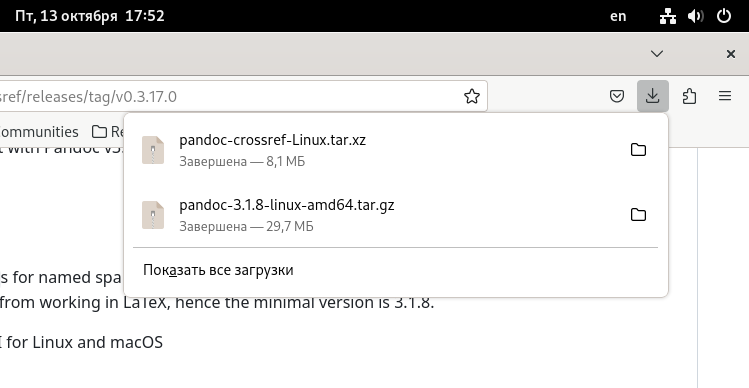{#fig:1 width=70%}

  Распаковываю скачанные архивы, копирую файлы pandoc и pandoc-crossref в каталог /usr/local/bin/ с правами пользователя root, используя sudo. Проверяю правильность. (рис. 4.2).

  
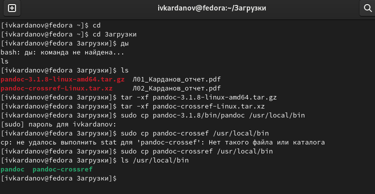{#fig:2 width=70%} 

  Установка TexLive. Скачиваю TexLive с официального сайта и распаковываю архив. Перехожу в распакованную папку с поомщью cd. Затем запускаю скрипт install-tl  правами root, используя sudo в начале команды. (рис. 4.3).
  
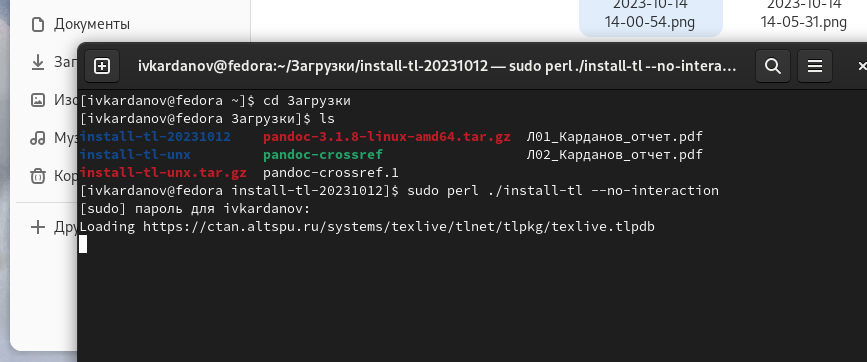{#fig:3 width=70%} 

  Добавляю /usr/local/texlive/2023/bin/x86_64-linux в свой PATH для текущей и будущих сессий. (рис. 4.4).
  
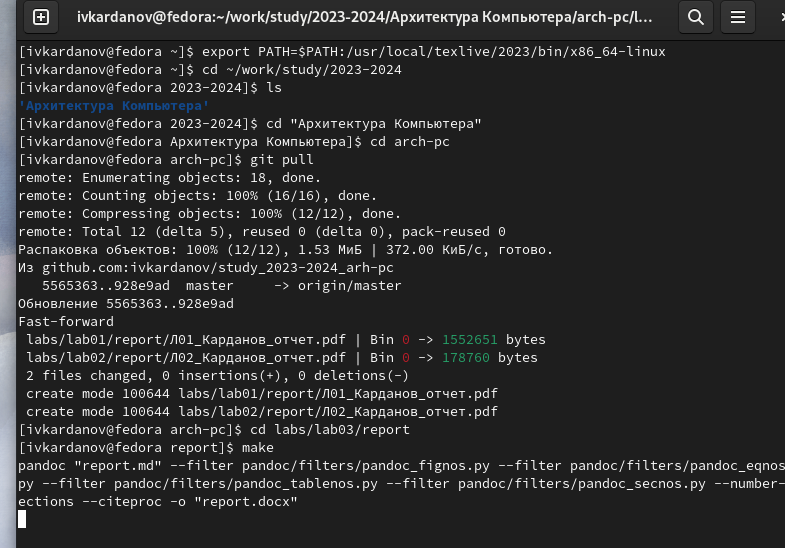{#fig:4 width=70%}

   2. Открыв терминал, перехожу в каталог курса, сформированный при выполненнии прошлой лаборатной работы. Обновляю локальный репозиторий.Перехожу в каталог с шаблоном отчета по лабораторной работе №3 и компилирую шаблон с использованием Makefile, введя команду make. (рис. 4.4).

  Проверяю правильность выполнения команды. (рис. 4.5).
  
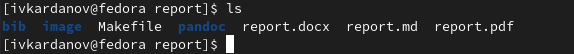{#fig:5 width=70%} 

  Открываю сгенерированный файл report.docx (рис. 4.6)
  
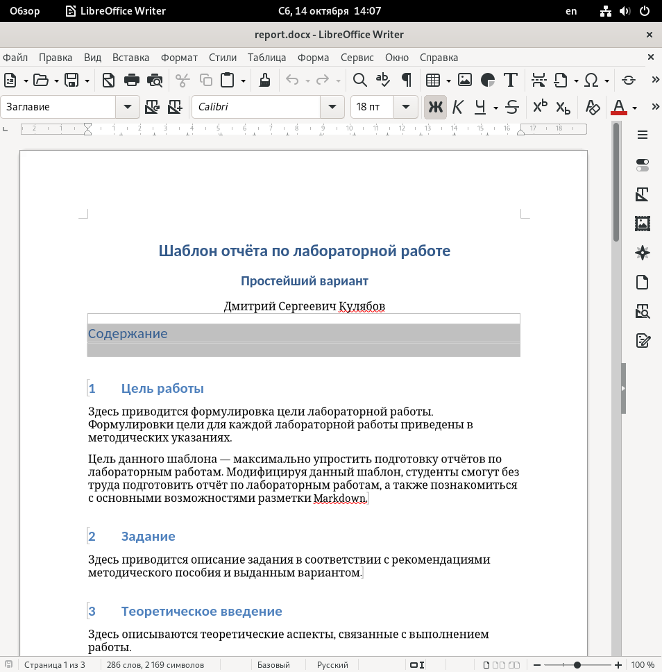{#fig:6 width=70%} 

 Открываю сгенерированный файл report.pdf (рис. 4.7)
  
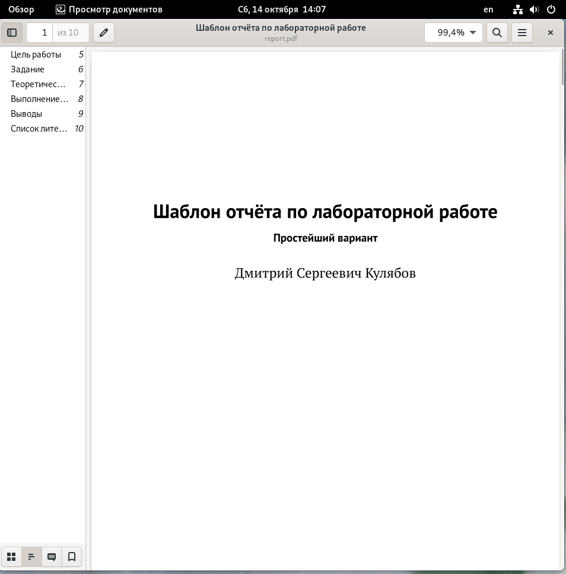{#fig:7 width=70%} 

  Удаляю полученные файлы с использованием Makefile, вводя команду make clean. Проверяю.(рис. 4.8).
  
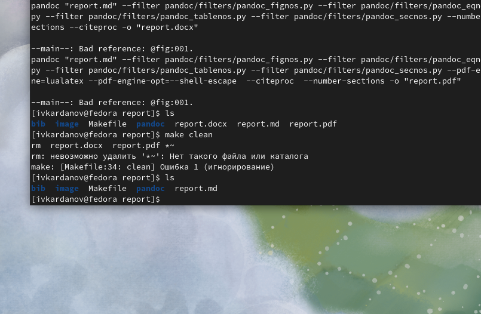{#fig:8 width=70%} 

  Открываю файл report.md с помощью gedit (рис. 4.9).
  
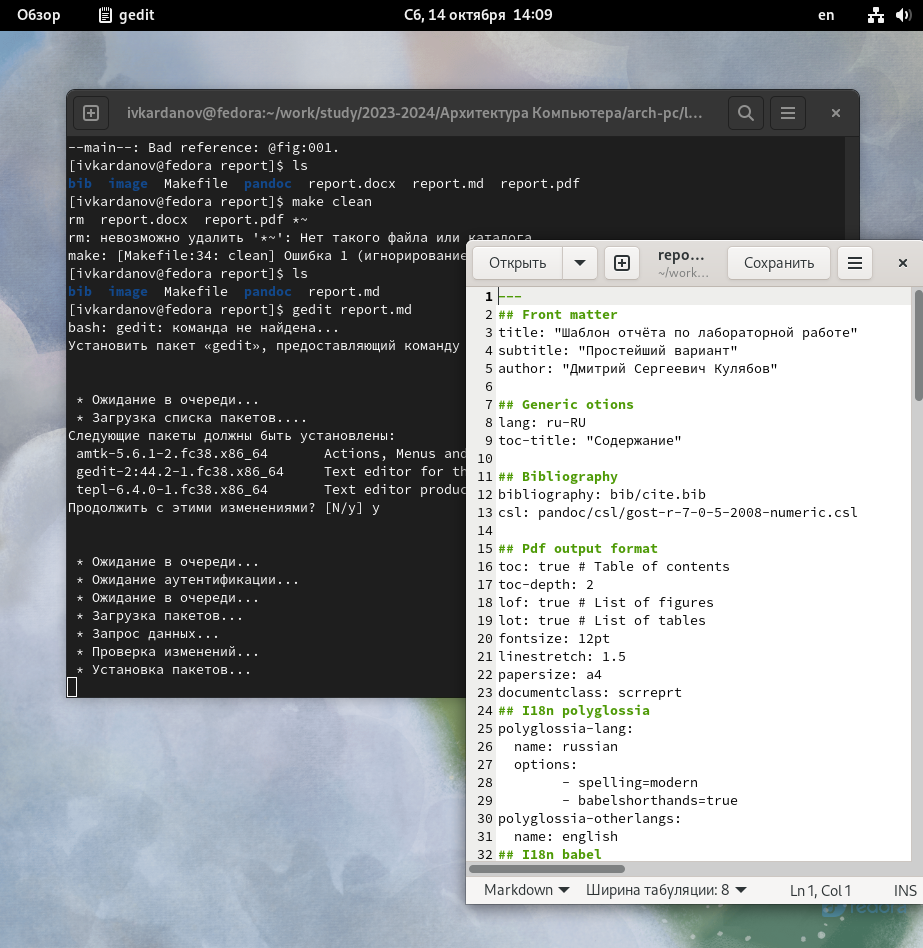{#fig:9 width=70%} 

  Копирую файл с новым названием с помощью утилиты cp. Открываю файл, начинаю заполнять отчёт(рис. 4.10).

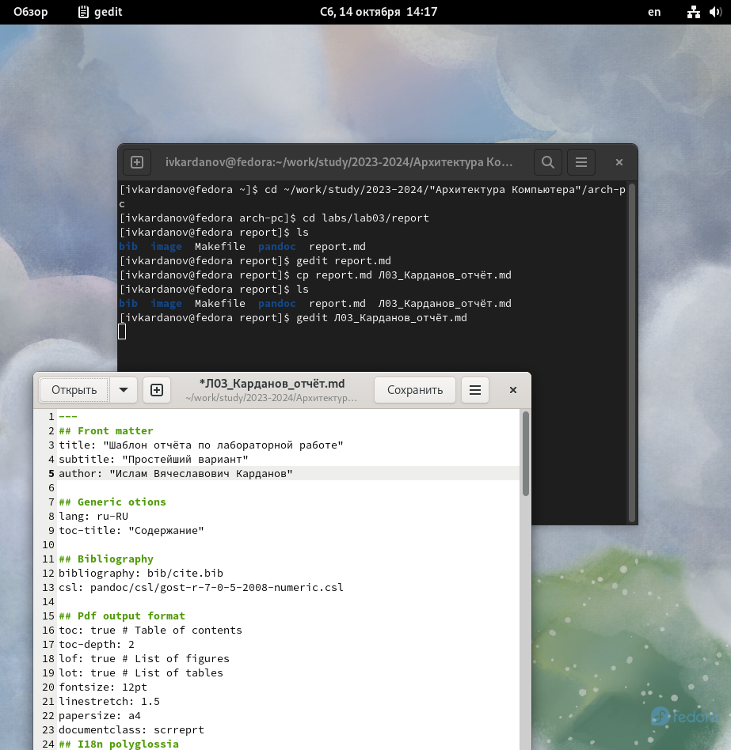{#fig:10 width=70%}

# Выполнение заданий для лабораторной работы 

  1. Перехожу в директорию lab02/report с помощью cd, чтобы там заполнять отчет по второй лабораторной работе, делаю аналогично с отчётом для 3-й лабораторной работы.(рис. 5.1).
  
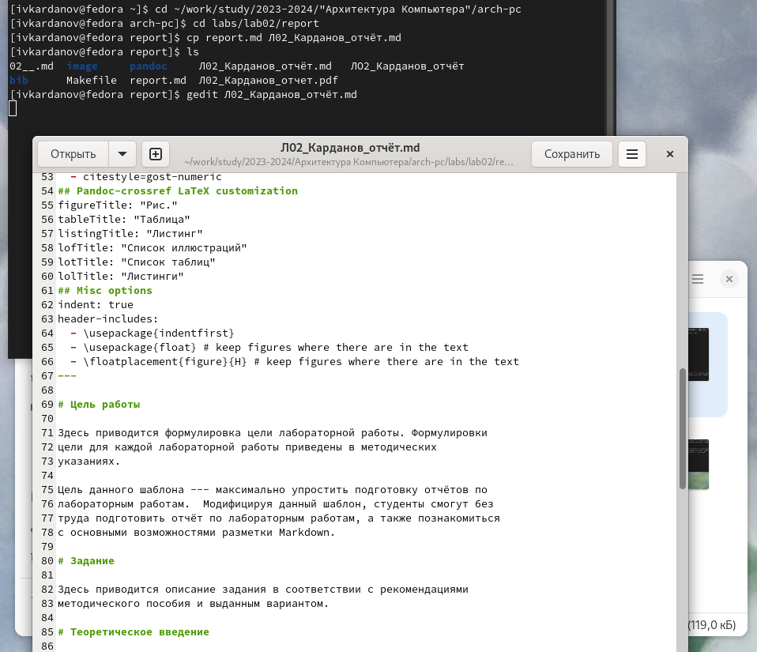{#fig:11 width=70%} 

  2. Делаю компиляцию файлов (рис. 5.2).
 
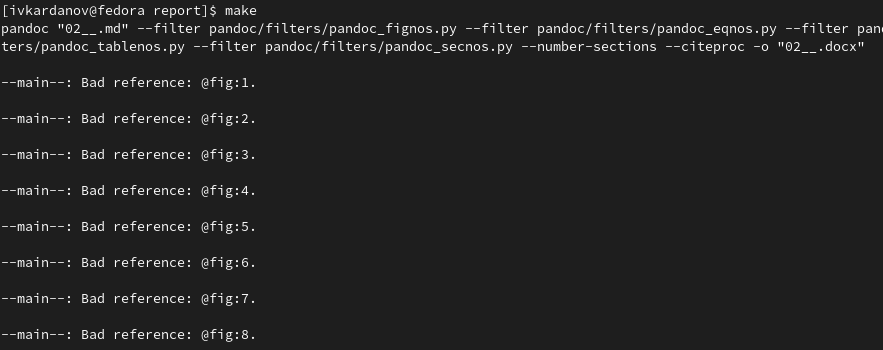{#fig:13 width=70%}

  3. Удаляю ненужные файлы (рис. 5.3).
  
 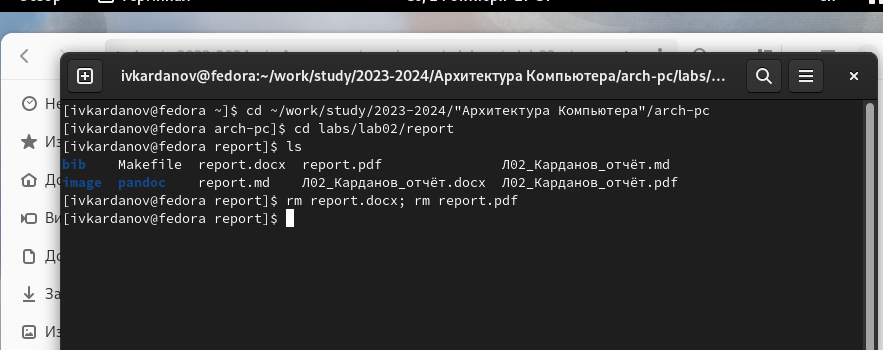{#fig:14 width=70%}
 
  4. Добавляю все на GitHub с помощью git add и сохраняю изменения с помощью git commit. (рис. 5.4).
  
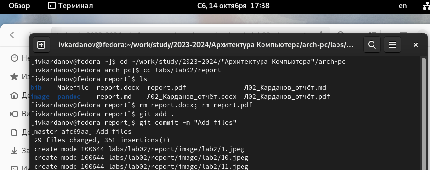{#fig:15 width=70%}

  5. Отправляю файлы на сервер с помощью команды. (рис. ).
  
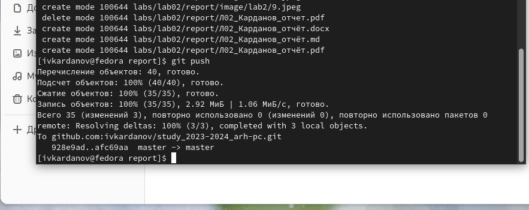{#fig:16 width=70%}

# Вывод 

  Я приобрёл практический опыт работы с легковесным языком Markdown.
  
# Список литературы
 
   1. Архитектура ЭВМ

