---
## Front matter
title: "Отчёт по лабораторной работе №5"
subtitle: "Дисциплина: Архитектура Компьютера"
author: "Ислам Карданов Вячеславович"

## Generic otions
lang: ru-RU
toc-title: "Содержание"

## Bibliography
bibliography: bib/cite.bib
csl: pandoc/csl/gost-r-7-0-5-2008-numeric.csl

## Pdf output format
toc: true # Table of contents
toc-depth: 2
lof: true # List of figures

fontsize: 12pt
linestretch: 1.5
papersize: a4
documentclass: scrreprt
## I18n polyglossia
polyglossia-lang:
  name: russian
  options:
	- spelling=modern
	- babelshorthands=true
polyglossia-otherlangs:
  name: english
## I18n babel
babel-lang: russian
babel-otherlangs: english
## Fonts
mainfont: PT Serif
romanfont: PT Serif
sansfont: PT Sans
monofont: PT Mono
mainfontoptions: Ligatures=TeX
romanfontoptions: Ligatures=TeX
sansfontoptions: Ligatures=TeX,Scale=MatchLowercase
monofontoptions: Scale=MatchLowercase,Scale=0.9
## Biblatex
biblatex: true
biblio-style: "gost-numeric"
biblatexoptions:
  - parentracker=true
  - backend=biber
  - hyperref=auto
  - language=auto
  - autolang=other*
  - citestyle=gost-numeric
## Pandoc-crossref LaTeX customization
figureTitle: "Рис."
tableTitle: "Таблица"
listingTitle: "Листинг"
lofTitle: "Список иллюстраций"

lolTitle: "Листинги"
## Misc options
indent: true
header-includes:
  - \usepackage{indentfirst}
  - \usepackage{float} # keep figures where there are in the text
  - \floatplacement{figure}{H} # keep figures where there are in the text
---

# Цель работы

Целью данной работы является приобретение практического опыта работы с Midnight Commander, освоение инструкций языка ассемблера mov и int.

# Задание

	1. Основы работы с Midnight Commander
	2. Подключение внешнего файла
	3. Выполнение заданий для самостоятельной работы
	
# Теоретическое введение

Midnight Commander (или просто mc) — это программа, которая позволяет просматривать структуру каталогов и выполнять основные операции по управлению файловой системой, т.е. mc является файловым менеджером. Midnight Commander позволяет сделать работу с файлами более удобной и наглядной.
Программа на языке ассемблера NASM, как правило, состоит из трёх секций: секция кода программы (SECTION .text), секция инициированных (известных во время компиляции) данных (SECTION .data) и секция неинициализированных данных (тех, под которые во время компиляции только отводится память, а значение присваивается в ходе выполнения программы) (SECTION .bss).
Для объявления инициированных данных в секции .data используются директивы DB, DW,
DD, DQ и DT, которые резервируют память и указывают, какие значения должны храниться в
этой памяти:
1) DB (define byte) — определяет переменную размером в 1 байт;
2) DW (define word) — определяет переменную размеров в 2 байта (слово);
3) DD (define double word) — определяет переменную размером в 4 байта (двойное слово);
4) DQ (define quad word)— определяет переменную размером в 8 байт (учетверённое слово);
5) DT (define ten bytes) — определяет переменную размером в 10 байт.
Директивы используются для объявления простых переменных и для объявления массивов. Для определения строк принято использовать директиву DB в связи с особенностями хранения данных в оперативной памяти. Для объявления неинициированных данных в секции .bss используются директивы resb, resw, resd и другие, которые сообщают ассемблеру, что необходимо зарезервировать заданное количество ячеек памяти. Инструкция языка ассемблера mov предназначена для дублирования данных источника в приёмнике. Здесь операнд dst — приёмник, а src — источник. В качестве операнда могут выступать регистры (register), ячейки памяти (memory) и непосредственные значения (const). Переслать значение из одной ячейки памяти в другую нельзя, для этого необходимо использовать две инструкции mov. Также необходимо учитывать то, что размер операндов приемника и источника должны совпадать. Инструкция языка ассемблера int предназначена для вызова прерывания с указанным номером. После вызова инструкции int 80h выполняется системный вызов какой-либо функции ядра Linux. При этом происходит передача управления ядру операционной системы. Чтобы узнать, какую именно системную функцию нужно выполнить, ядро извлекает номер системного вызова из регистра eax. Поэтому перед вызовом прерывания необходимо поместить в тот регистр нужный номер. Кроме того, многим системным функциям требуется передавать какие-либо параметры. По принятым в ОС Linux правилам эти параметры помещаются в порядке следования в остальные регистры процессора: ebx, ecx, edx. Если системная функция должна вернуть значение, то она помещает его в регистр eax.

# Выполнение лабораторной работы
 
 4.1) Основы Midnight Commander
 
 Открываю Midnight Commander, введя в терминале команду mc.

 Перехожу в каталог ~/work/arch-pc, используя файловый менеджер mc. (рис. @fig:001). 
 
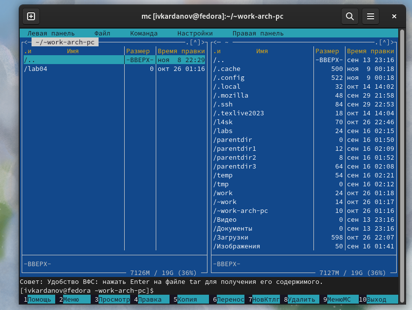{#fig:001 width=70%}
 
 С помощью функциональной клавиши F7 создаю каталог lab05. (рис. @fig:002).

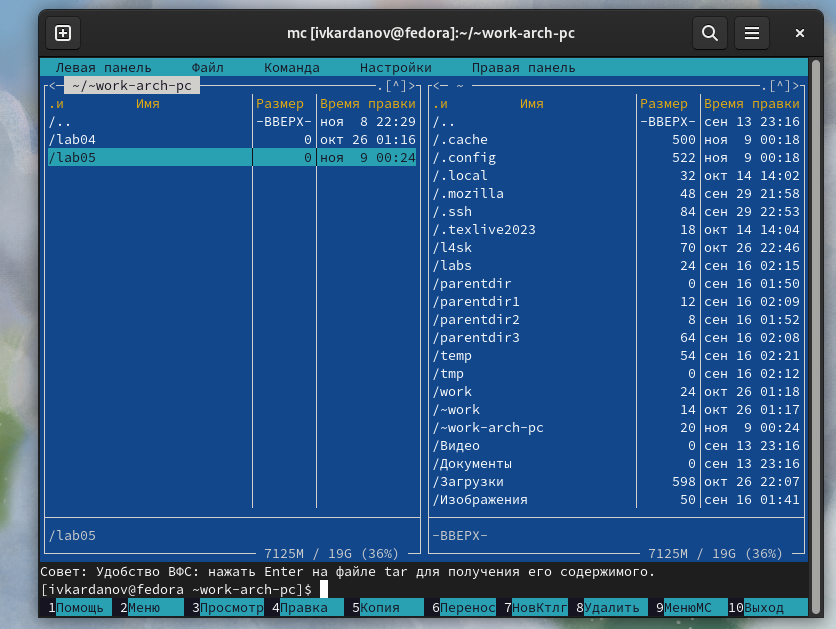{#fig:002 width=70%}
 
 В строке ввода прописываю команду touch lab5-1.asm, чтобы создать соответствующий файл. (рис. @fig:003).

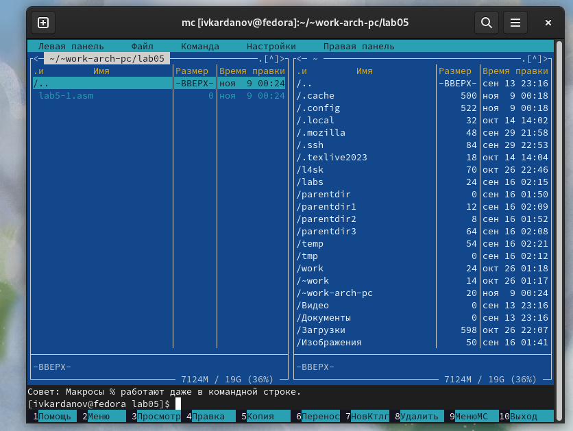{#fig:003 width=70%}
 
 С помощью функциональной клавиши F4 открываю созданный файл для его изменения. Ввожу в файл нужный код программы. Затем сохраняю и выхожу . (рис. @fig:004).
 
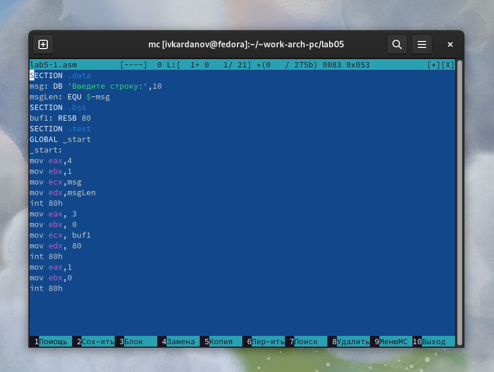{#fig:004 width=70%}

 Для проверки открываю файл в режиме просмотра (рис. @fig:005).

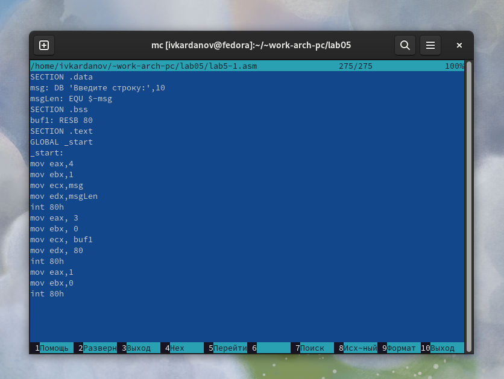{#fig:005 width=70%}

 Ввожу команду nasm -f elf lab5-1.asm. Создается объектный файл lab5-1.o. Ввожу команду ld -m elf_i386 -o lab5-1 lab5-1.o. Создается файл lab5-1. Запускаю исполняемый файл. Программа выводит  “Введите строку:”
ввожу свои ФИО, программа останавливается. (рис. @fig:006).

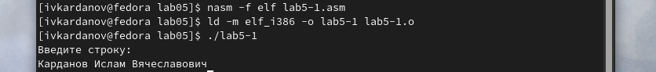{#fig:006 width=70%}

 4.2) Подключение внешнего файла
 
Скачиваю файл in_out.asm. Копирую файл in_out.asm из каталога "Загрузки", в созданный каталог lab05. (рис. @fig:007).
 
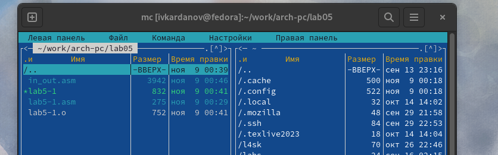{#fig:007 width=70%}

 Далее копирую файл lab5-1 в тот же каталог, но с другим именем, для этого в окне mc прописываю путь к каталогу и новое имя файла. (рис. @fig:008).
 
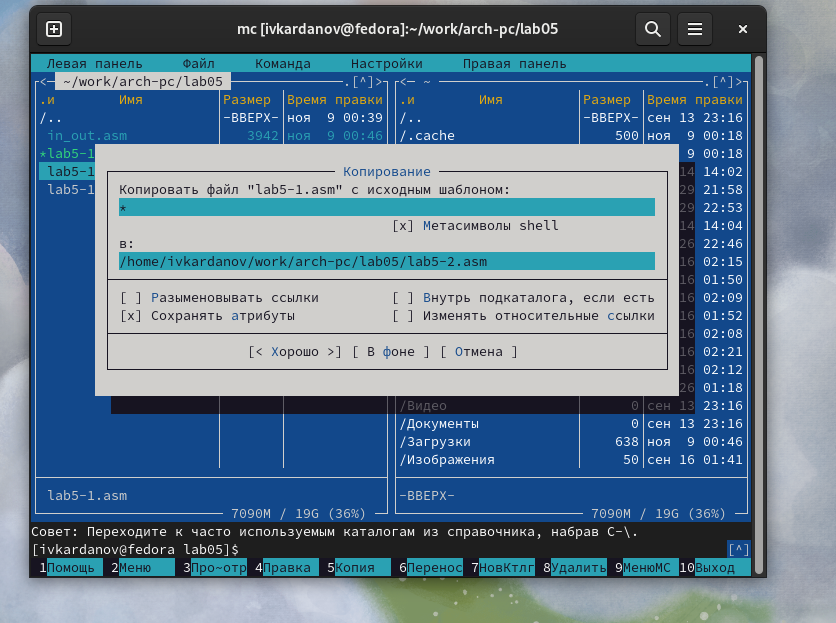{#fig:008 width=70%}

 Изменяю содержимое файла lab05-2.asm, чтобы в программе использовались подпрограммы из внешнего файла inout.asm (рис. @fig:009).

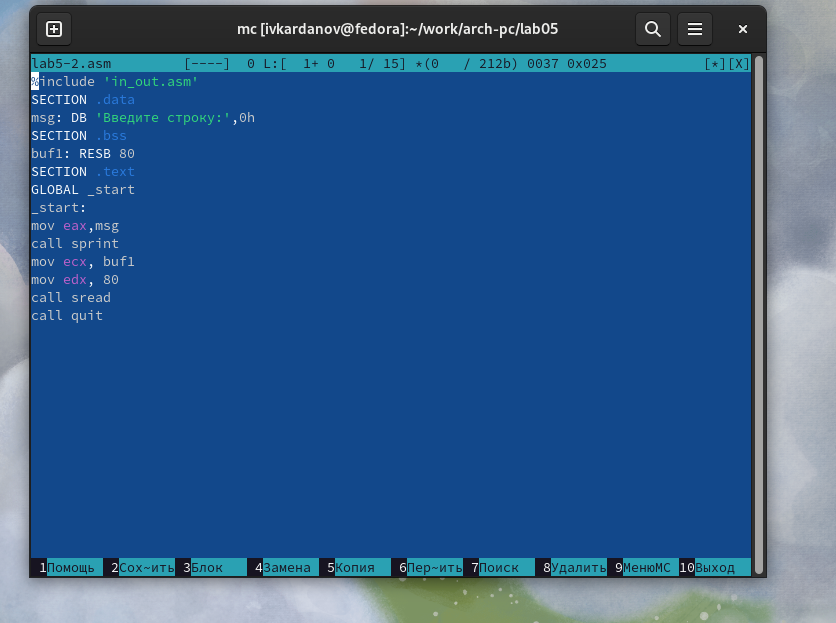{#fig:009 width=70%}

 Транслирую текст программы файла в объектный файл командой nasm -f elf lab5-2.asm. Создался объектный файл la5-2.o.Выполняю компоновку объектного файла с помощью команды ld -m elf_i386 -o lab5-2 lab5-2.o Создался исполняемый файл lab5-2. Запускаю его. (рис. @fig:010).
 
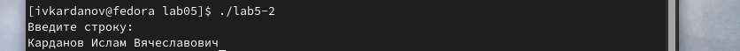{#fig:010 width=70%}

 Открываю файл lab5-2.asm в режиме правки, меняю sprintLF на sprint. Далее проделываю те же действия что и раннее для выполнения файла. (рис. @fig:011).
 
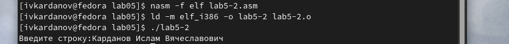{#fig:011 width=70%}

 Разница между первым исполняемым файлом и вторым  в том, что запуск первого запрашивает ввод  с новой строки, а программа, которая исполняется при запуске второго, запрашивает ввод без переноса на новую строку, потому что в этом заключается различие между программами sprintLF и sprint.

 4.3) Выполнение заданий для самостоятельной работы
 
 Создаю копию файла lab5-1.asm с именем lab5-1-1.asm. (рис. @fig:012).
 
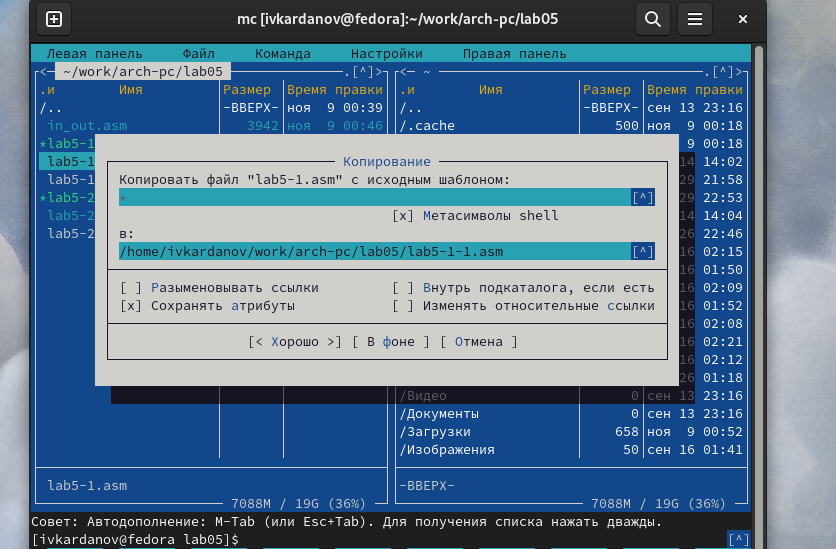{#fig:012 width=70%}
 
 Изменяю программу так, чтобы кроме вывода приглашения и запроса ввода, она выводила вводимую пользователем строку. (рис. @fig:013)
 
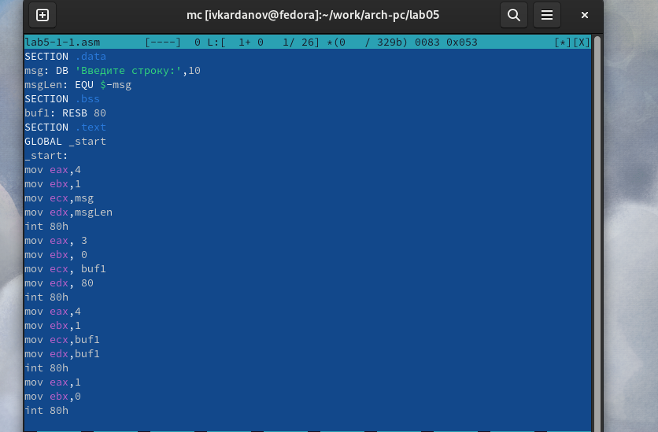{#fig:013 width=70%}

 Создаю объектный файл lab5-1-1.o, отдаю его на обработку компоновщику, получаю исполняемый файл lab5-1-1, запускаю полученный исполняемый файл. Программа запрашивает ввод, ввожу ФИО, далее программа выводит введенные данные.(рис. @fig:014)
 
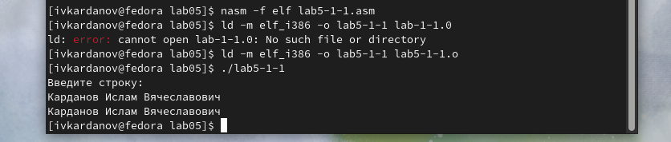{#fig:014 width=70%}

 Создаю копию файла lab5-2.asm с именем lab5-2-1.asm. Изменяю программу так, чтобы кроме вывода приглашения и запроса ввода, она выводила вводимую пользователем строку. (рис. @fig:015)
 
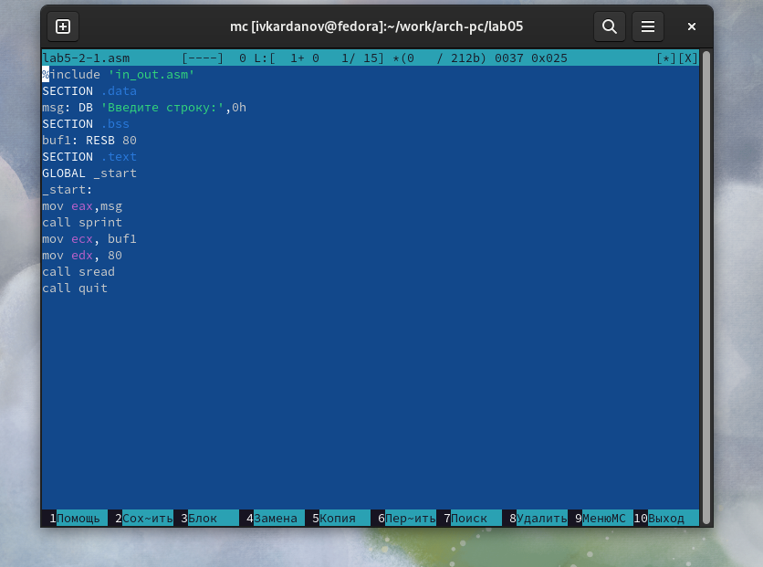{#fig:015 width=70%}

  Создаю объектный файл lab5-2-1.o, отдаю его на обработку компоновщику, получаю исполняемый файл lab5-2-1, запускаю полученный исполняемый файл. Программа запрашивает ввод, ввожу ФИО, далее программа выводит введенные данные.(рис. @fig:016)
 
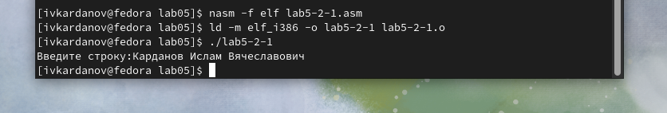{#fig:016 width=70%}

# Выводы

 При выполнении заданий я обрёл практический опыт работы с Midnight Commander и освоил инструкции языка ассемблера.
 
# Список литературы{.unnumbered}

 [Архитектура ЭВМ](https://esystem.rudn.ru/pluginfile.php/2089085/mod_resource/content/0/Лабораторная%20работа%20№5.%20Основы%20работы%20с%20Midnight%20Commander%20().%20Структура%20программы%20на%20языке%20ассемблера%20NASM.%20Системные%20вызовы%20в%20ОС%20GNU%20Linux.pdf)
