---
## Front matter
title: "Отчёт по лабораторной работе №8"
subtitle: "Дисциплина: Архитектура Компьютера"
author: "Ислам Вячеславович Карданов"

## Generic otions
lang: ru-RU
toc-title: "Содержание"

## Bibliography
bibliography: bib/cite.bib
csl: pandoc/csl/gost-r-7-0-5-2008-numeric.csl

## Pdf output format
toc: true # Table of contents
toc-depth: 2
lof: true # List of figures

fontsize: 12pt
linestretch: 1.5
papersize: a4
documentclass: scrreprt
## I18n polyglossia
polyglossia-lang:
  name: russian
  options:
	- spelling=modern
	- babelshorthands=true
polyglossia-otherlangs:
  name: english
## I18n babel
babel-lang: russian
babel-otherlangs: english
## Fonts
mainfont: PT Serif
romanfont: PT Serif
sansfont: PT Sans
monofont: PT Mono
mainfontoptions: Ligatures=TeX
romanfontoptions: Ligatures=TeX
sansfontoptions: Ligatures=TeX,Scale=MatchLowercase
monofontoptions: Scale=MatchLowercase,Scale=0.9
## Biblatex
biblatex: true
biblio-style: "gost-numeric"
biblatexoptions:
  - parentracker=true
  - backend=biber
  - hyperref=auto
  - language=auto
  - autolang=other*
  - citestyle=gost-numeric
## Pandoc-crossref LaTeX customization
figureTitle: "Рис."
tableTitle: "Таблица"
listingTitle: "Листинг"
lofTitle: "Список иллюстраций"

lolTitle: "Листинги"
## Misc options
indent: true
header-includes:
  - \usepackage{indentfirst}
  - \usepackage{float} # keep figures where there are in the text
  - \floatplacement{figure}{H} # keep figures where there are in the text
---

# Цель работы

Целью данной работы является приобретение практического опыта в написании программ с использованием циклов и обработкой аргументов командной строки.

# Задание

	1. Реализация циклов в NASM.
	2. Обработка аргументов командной строки.
	3. Выполнение заданий для самостоятельной работы
	
# Теоретическое введение

Стек — это структура данных, организованная по принципу LIFO («Last In — First Out» или «последним пришёл — первым ушёл»). Стек является частью архитектуры процессора и реализован на аппаратном уровне. Основной функцией стека является функция сохранения адресов возврата и передачи аргументов при вызове процедур. Кроме того, в нём выделяется память для локальных переменных и могут временно храниться значения регистров. Стек имеет вершину, адрес последнего добавленного элемента, который хранится в регистре esp (указатель стека). Противоположный конец стека называется дном. При помещении значения в стек указатель стека уменьшается, а при извлечении — увеличивается. Для стека существует две основные операции:1) добавление элемента в вершину стека (push). 2) извлечение элемента из вершины стека (pop).
Команда push размещает значение в стеке, т.е. помещает значение в ячейку памяти, на которую указывает регистр esp, после этого значение регистра esp увеличивается на 4. Данная команда имеет один операнд — значение, которое необходимо поместить в стек. Существует ещё две команды для добавления значений в стек. Это команда pusha, которая помещает в стек содержимое всех регистров общего назначения в следующем порядке: ах, сх, dx, bх, sp, bp, si, di. А также команда pushf, которая служит для перемещения в стек содержимого регистра флагов. Обе эти команды не имеют операндов. Команда pop извлекает значение из стека, т.е. извлекает значение из ячейки памяти, на которую указывает регистр esp, после этого уменьшает значение регистра esp на 4. У этой команды также один операнд, который может быть регистром или переменной в памяти. Нужно помнить, что извлечённый из стека элемент не стирается из памяти и остаётся как “мусор”, который будет перезаписан при записи нового значения в стек. Для организации циклов существуют специальные инструкции. Для всех инструкций максимальное количество проходов задаётся в регистре ecx. Иструкция loop выполняется в два этапа. Сначала из регистра ecx вычитается единица и его значение сравнивается с нулём. Если регистр не равен нулю, то выполняется переход к указанной метке.

# Выполнение лабораторной работы
 
 4.1) Реализация циклов в NASM.
 
 С помощью утилиты mkdir создаю директорию lab08 для выполнения соответствующей лабораторной работы. Перехожу в созданный каталог с помощью утилиты cd. С помощью touch создаю файл lab8-1.asm. (рис. @fig:001).

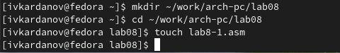{#fig:001 width=70%}

 Открываю созданный файл lab8-1.asm, вставляю в него следующую программу:  (рис. @fig:002).

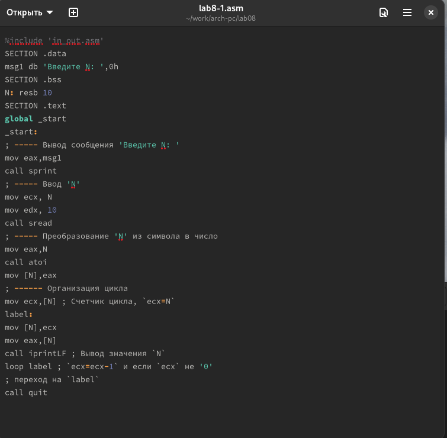{#fig:002 width=70%}

 Дублирую в текущий каталог файл in_out.asm с помощью утилиты cp, т.к. будет использоваться в дальнейшем. Создаю исполняемый файл и запускаю его. Мы видим, что использование инструкции loop позволяет выводить значения регистра ecx циклично. (рис. @fig:003).
 
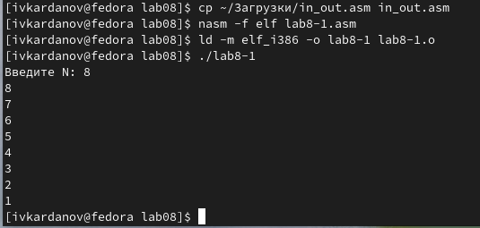{#fig:003 width=70%}
 
 Изменяю значение ecx в цикле. (рис. @fig:004).

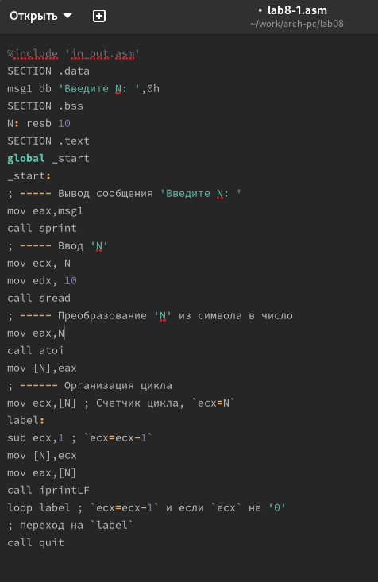{#fig:004 width=70%}
 
 Создаю новый исполняемый файл программы и запускаю его. Мы видим, что регистр ecx в цикле принимает совершенно разные значения. И число проходов цикла далеко не соответствует ли значению 𝑁, введенному с клавиатуры. (рис. @fig:005).
 
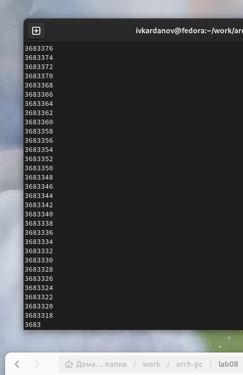{#fig:005 width=70%}

 Вношу изменения в текст программы, добавив команды push, pop для сохранения значения счётчика цикла loop. (рис. @fig:006).

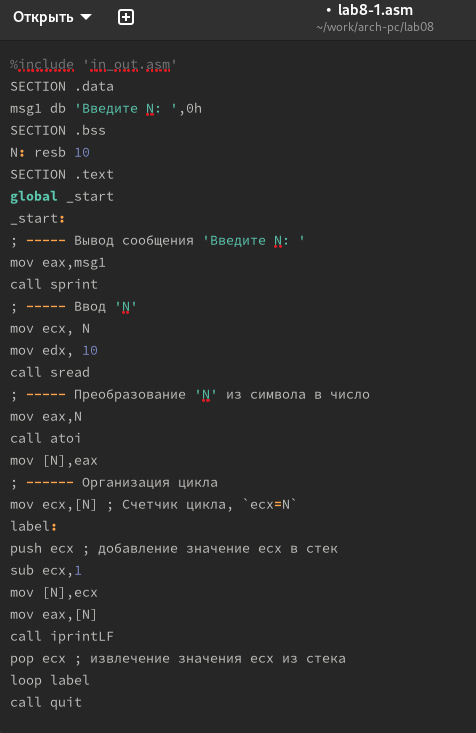{#fig:006 width=70%}

 Создаю и запускаю исполняемый файл. В данном случае число проходов цикла соответствует значению 𝑁 введенному с клавиатуры. Счёт идёт, не от 8-ми, а от 7-ми, но включается 0 (рис. @fig:007).
 
{#fig:007 width=70%}

 4.2) Обработка аргументов командной строки.
 
 Создаю файл lab8-2.asm. Редактирую его, вводя предлагаемую программу. (рис. @fig:008).
 
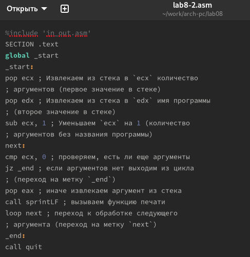{#fig:008 width=70%}

 Создаю исполняемый файл после редактирования. (рис. @fig:009).
 
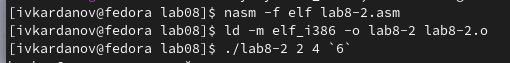{#fig:009 width=70%}

 Запускаю исполняемый файл. Программой было обработано 3 аргумента - ровно те, которые я указал при запуске. (рис. @fig:010).

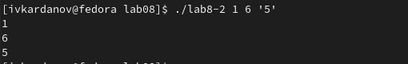{#fig:010 width=70%}

 Создаю файл lab8-3.asm. Ввожу в него следующую программу: (рис. @fig:011).
 
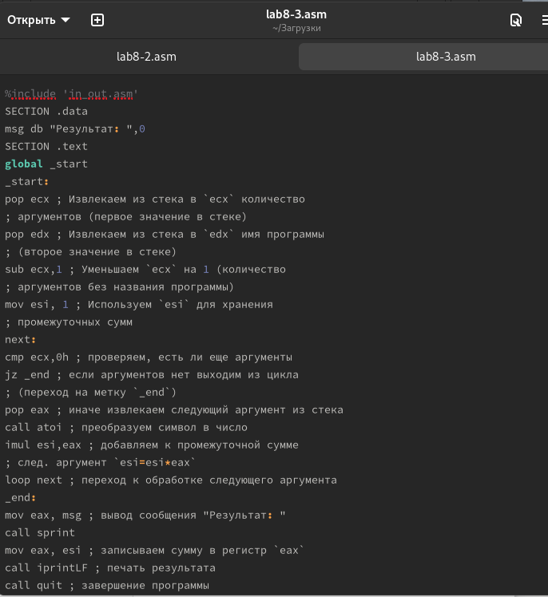{#fig:011 width=70%}

 Создаю исполняемый файл. (рис. @fig:012).
 
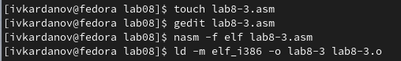{#fig:012 width=70%}

 Указываю нужные аргументы. Убеждаюсь в правильности работы программы. (рис. @fig:013).
  
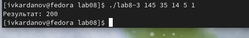{#fig:013 width=70%}

 Меняю текст программы для вычисления произведения аргументов в командной строке. (рис. @fig:014).
 
{#fig:014 width=70%}

 Создаю и запускаю исполняемый файл. При проверке вижу, что выводятся верные значения. (рис. @fig:015).
 
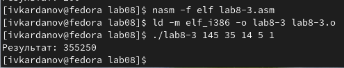{#fig:015 width=70%}
 
 4.3) Выполнение заданий для самостоятельной работы
 
 Создаю sr.asm с помощью утилиты touch. Открываю файл, ввожу в него текст программы для суммирования значений функции, предложенной в варианте 19, полученным мною при выполнении прошлой лабораторной работы. Проводим привычные операции и запускаем файл. (рис. @fig:016)
 
{#fig:016 width=70%}

 Листинг 4.1 - Программа для суммирования нескольких значений функции, предложенной в варианте 7.
 
 
 
 
```%include 'in_out.asm'

SECTION .data

msg db "Результат: ",0

SECTION .text

global _start

_start:

pop ecx ; Извлекаем из стека в `ecx` количество

; аргументов (первое значение в стеке)

pop edx ; Извлекаем из стека в `edx` имя программы

; (второе значение в стеке)

sub ecx,1 ; Уменьшаем `ecx` на 1 (количество

; аргументов без названия программы)

mov esi, 0 ; Используем `esi` для хранения

; промежуточных сумм

next:

cmp ecx,0h ; проверяем, есть ли еще аргументы

jz _end ; если аргументов нет выходим из цикла

; (переход на метку `_end`)

pop eax ; иначе извлекаем следующий аргумент из стека

call atoi ; преобразуем символ в число

imul eax,8

add eax,-3

add esi,eax ; добавляем к промежуточной сумме

loop next ; переход к обработке следующего аргумента

_end:

mov eax, msg ; вывод сообщения "Результат: "

call sprint

mov eax, esi ; записываем сумму в регистр `eax`

call iprintLF ; печать результата

call quit ; завершение программы
```


# Выводы

 При выполнении лабораторной работы я приобрел практический опыт в написании программ с использованием циклов и обработкой аргументов командной строки.
 
# Список литературы{.unnumbered}

[Архитектура компьютера и ЭВМ](https://esystem.rudn.ru/pluginfile.php/2089095/mod_resource/content/0/Лабораторная%20работа%20№8.%20Программирование%20цикла.%20Обработка%20аргументов%20командной%20строки..pdf)
