---
## Front matter
title: "Отчёт по лабораторной работе №9"
subtitle: "Дисциплина: Архитектура Компьютера"
author: "Егор Витальевич Кузьмин"

## Generic otions
lang: ru-RU
toc-title: "Содержание"

## Bibliography
bibliography: bib/cite.bib
csl: pandoc/csl/gost-r-7-0-5-2008-numeric.csl

## Pdf output format
toc: true # Table of contents
toc-depth: 2
lof: true # List of figures

fontsize: 12pt
linestretch: 1.5
papersize: a4
documentclass: scrreprt
## I18n polyglossia
polyglossia-lang:
  name: russian
  options:
	- spelling=modern
	- babelshorthands=true
polyglossia-otherlangs:
  name: english
## I18n babel
babel-lang: russian
babel-otherlangs: english
## Fonts
mainfont: PT Serif
romanfont: PT Serif
sansfont: PT Sans
monofont: PT Mono
mainfontoptions: Ligatures=TeX
romanfontoptions: Ligatures=TeX
sansfontoptions: Ligatures=TeX,Scale=MatchLowercase
monofontoptions: Scale=MatchLowercase,Scale=0.9
## Biblatex
biblatex: true
biblio-style: "gost-numeric"
biblatexoptions:
  - parentracker=true
  - backend=biber
  - hyperref=auto
  - language=auto
  - autolang=other*
  - citestyle=gost-numeric
## Pandoc-crossref LaTeX customization
figureTitle: "Рис."
tableTitle: "Таблица"
listingTitle: "Листинг"
lofTitle: "Список иллюстраций"

lolTitle: "Листинги"
## Misc options
indent: true
header-includes:
  - \usepackage{indentfirst}
  - \usepackage{float} # keep figures where there are in the text
  - \floatplacement{figure}{H} # keep figures where there are in the text
---

# Цель работы

  Целью данной работы является приобретение практического опыта в написании программ с использованием подпрограмм, а также знакомство с методами отладки при помощи gdb и его основными возможностями.

# Задание

	1. Реализация подпрограмм в NASM.
	2. Отладка программ при помощи gdb.
	3. Выполнение заданий для самостоятельной работы
	
# Теоретическое введение

Отладка — это процесс поиска и исправления ошибок в программе. В общем случае егоможно разделить на четыре этапа:

• обнаружение ошибки;

• поиск её местонахождения;

• определение причины ошибки;

• исправление ошибки.

Можно выделить следующие типы ошибок:

• синтаксические ошибки — обнаруживаются во время трансляции исходного кода и вызваны нарушением ожидаемой формы или структуры языка;

• семантические ошибки — являются логическими и приводят к тому, что программа запускается, отрабатывает, но не даёт желаемого результата;

• ошибки в процессе выполнения — не обнаруживаются при трансляции и вызывают прерывание выполнения программы (например, это ошибки, связанные с переполнением или делением на ноль).

Второй этап — поиск местонахождения ошибки. Некоторые ошибки обнаружить довольно трудно. Лучший способ найти место в программе, где находится ошибка, это разбить программу на части и произвести их отладку отдельно друг от друга.

Третий этап — выяснение причины ошибки. После определения местонахождения ошибки обычно проще определить причину неправильной работы программы.

Последний этап — исправление ошибки. После этого при повторном запуске программы, может обнаружиться следующая ошибка, и процесс отладки начнётся заново.

Наиболее часто применяют следующие методы отладки:

• создание точек контроля значений на входе и выходе участка программы (например, вывод промежуточных значений на экран — так называемые диагностические сообщения);

• использование специальных программ-отладчиков.

Отладчики позволяют управлять ходом выполнения программы, контролировать и изменять данные. Это помогает быстрее найти место ошибки в программе и ускорить её
исправление. Наиболее популярные способы работы с отладчиком — это использование точек останова и выполнение программы по шагам. Пошаговое выполнение — это выполнение программы с остановкой после каждой строчки, чтобы программист мог проверить значения переменных и выполнить другие действия. Точки останова — это специально отмеченные места в программе, в которых программа-отладчик приостанавливает выполнение программы и ждёт команд. Наиболее популярные виды точек останова:

• Breakpoint — точка останова (остановка происходит, когда выполнение доходит до определённой строки, адреса или процедуры, отмеченной программистом);

• Watchpoint — точка просмотра (выполнение программы приостанавливается, если программа обратилась к определённой переменной: либо считала её значение, либо изменила его).

Точки останова устанавливаются в отладчике на время сеанса работы с кодом программы, т.е. они сохраняются до выхода из программы-отладчика или до смены отлаживаемой
программы.
GDB (GNU Debugger — отладчик проекта GNU) [1] работает на многих UNIX-подобных системах и умеет производить отладку многих языков программирования. GDB предлагает обширные средства для слежения и контроля за выполнением компьютерных программ. Отладчик не содержит собственного графического пользовательского интерфейса и использует стандартный текстовый интерфейс консоли. Однако для GDB существует несколько сторонних графических надстроек, а кроме того, некоторые интегрированные среды разработки используют его в качестве базовой подсистемы отладки. Отладчик GDB (как и любой другой отладчик) позволяет увидеть, что происходит «внутри» программы в момент её выполнения или что делает программа в момент сбоя. GDB может выполнять следующие действия:

• начать выполнение программы, задав всё, что может повлиять на её поведение;

• остановить программу при указанных условиях;

• исследовать, что случилось, когда программа остановилась;

• изменить программу так, чтобы можно было поэкспериментировать с устранением эффектов одной ошибки и продолжить выявление других.

После запуска gdb выводит текстовое сообщение — так называемое «nice GDB logo». В следующей строке появляется приглашение (gdb) для ввода команд. Далее приведён список некоторых команд GDB. Команда run (сокращённо r) — запускает отлаживаемую программу в оболочке GDB. Если точки останова были заданы, то отладчик останавливается на соответствующей команде и выдаёт номер точки останова, адрес и дополнительную информацию — текущую строку, имя процедуры, и др. Команда kill (сокращённо k) прекращает отладку программы, после чего следует вопрос о прекращении процесса отладки. Если в ответ введено y (то есть «да»), отладка программы прекращается. Командой run её можно начать заново, при этом все точки останова (breakpoints), точки просмотра (watchpoints) и точки отлова (catchpoints) сохраняются. Для выхода из отладчика используется команда quit (или сокращённо q). Если есть файл с исходным текстом программы, а в исполняемый файл включена информация о номерах строк исходного кода, то программу можно отлаживать, работая в отладчике непосредственно с её исходным текстом. Чтобы программу можно было отлаживать на уровне строк исходного кода, она должна быть откомпилирована с ключом -g.
Установить точку останова можно командой break (кратко b). Типичный аргумент этой команды — место установки. Его можно задать как имя метки или как адрес. Чтобы не было путаницы с номерами, перед адресом ставится «звёздочка». Для продолжения остановленной программы используется команда continue (c) (gdb). Выполнение программы будет происходить до следующей точки останова. В качестве аргумента может использоваться целое число 𝑁, которое указывает отладчику проигнорировать 𝑁 − 1 точку останова (выполнение остановится на 𝑁-й точке). Команда stepi (кратко sI) позволяет выполнять программу по шагам, т.е. данная команда выполняет ровно одну инструкцию. Как уже упоминалось, отладчик может показывать содержимое ячеек памяти и регистров, а при необходимости позволяет вручную изменять значения регистров и переменных. Посмотреть содержимое регистров можно с помощью команды info registers (или i r). Подпрограмма — это, как правило, функционально законченный участок кода, который можно многократно вызывать из разных мест программы. В отличие от простых переходов из подпрограмм существует возврат на команду, следующую за вызовом. Если в программе встречается одинаковый участок кода, его можно оформить в виде подпрограммы, а во всех нужных местах поставить её вызов. При этом подпрограмма будет содержаться в коде в одном экземпляре, что позволит уменьшить размер кода всей программы. Для вызова подпрограммы из основной программы используется инструкция call, которая заносит адрес следующей инструкции в стек и загружает в регистр eip адрес соответствующей подпрограммы, осуществляя таким образом переход. Затем начинается выполнение подпрограммы, которая, в свою очередь, также может содержать подпрограммы. Подпрограмма завершается инструкцией ret, которая извлекает из стека адрес, занесённый туда соответствующей инструкцией call, и заносит его в eip. После этого выполнение основной программы возобновится с инструкции, следующей за инструкцией call.


# Выполнение лабораторной работы
 
 4.1) Реализация подпрограмм в NASM.
 
 С помощью утилиты mkdir создаю директорию lab09 для выполнения соответствующей лабораторной работы. Перехожу в созданный каталог с помощью утилиты cd. С помощью touch создаю файл lab09-1.asm. Копирую в текущий каталог файл in_out.asm с помощью утилиты cp, ибо он будет использоваться в дальнейшем. Открываю созданный файл lab09-1.asm, вставляю в него следующую программу:  (рис. @fig:001).

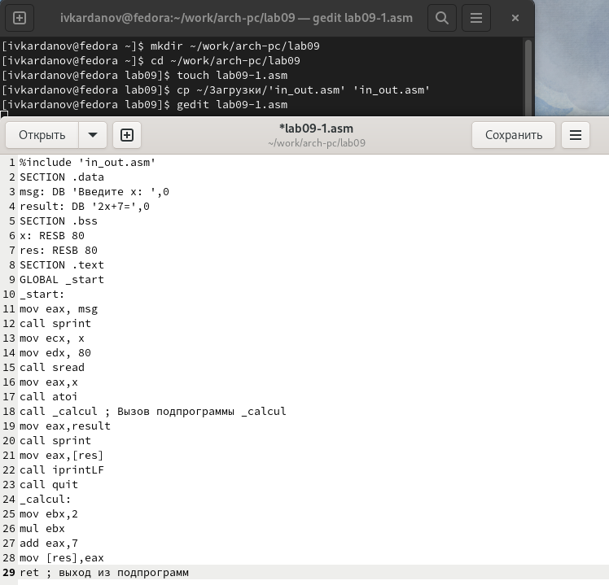{#fig:001 width=70%}

 Создаю исполняемый файл и запускаю его.  (рис. @fig:002).

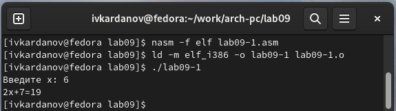{#fig:002 width=70%}

 Добавляю подпрограмму subcalcul_, чтобы программа вычисляла значение f(g(x)). (рис. @fig:003).
 
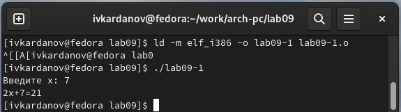{#fig:003 width=70%}
 
 Создаю исполняемый файл и убеждаюсь в правильности его работы. (рис. @fig:004).

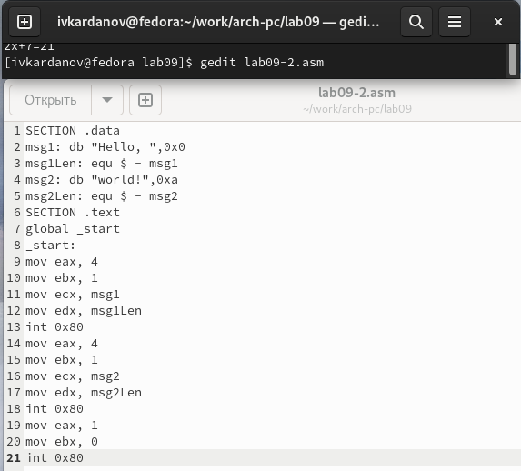{#fig:004 width=70%}

 4.2) Отладка программ при помощи gdb.
 
 Создаю файл lab09-2.asm и вношу в него следующий текст программы: (рис. @fig:005).
 
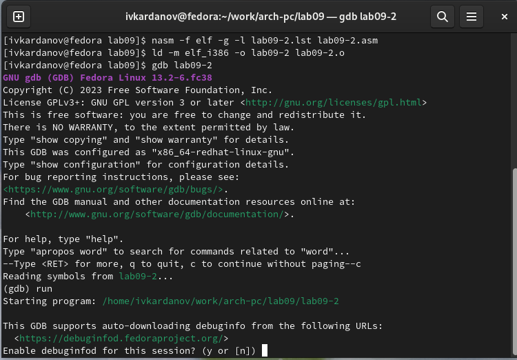{#fig:005 width=70%}

 Создаю исполняемый файл и загружаю его в отладчик gdb,  запускаю программу с помощью команды run. (рис. @fig:006).

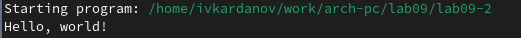{#fig:006 width=70%}

 Убеждаюсь в правильности работы программы. (рис. @fig:007).
 
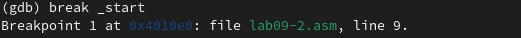{#fig:007 width=70%}
 
 Устанавливаю метку _start. (рис. @fig:008).
 
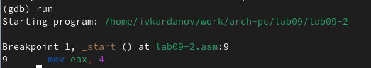{#fig:008 width=70%}

 Запускаю программу, видим работу метки. (рис. @fig:009).
 
{#fig:009 width=70%}

 Смотрю дисассимилированный код программы сначала обычный, потом с синтаксисом intel. (рис. @fig:010).

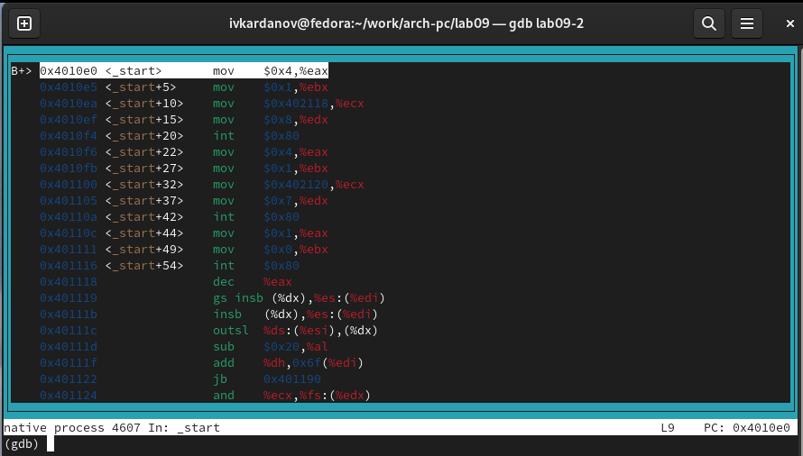{#fig:010 width=70%}

 Различия отображения синтаксиса можно наблюдать в правой части окна. Затем я включаю режим псевдографики (рис. @fig:011).
 
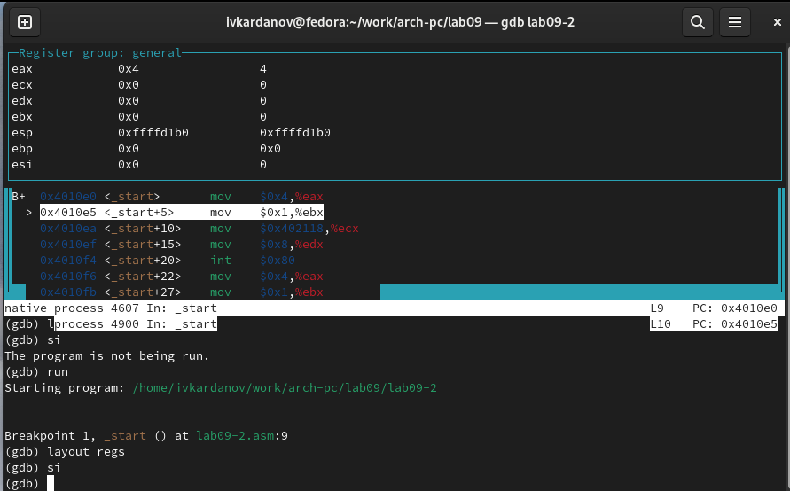{#fig:011 width=70%}

 (рис. @fig:012).
 
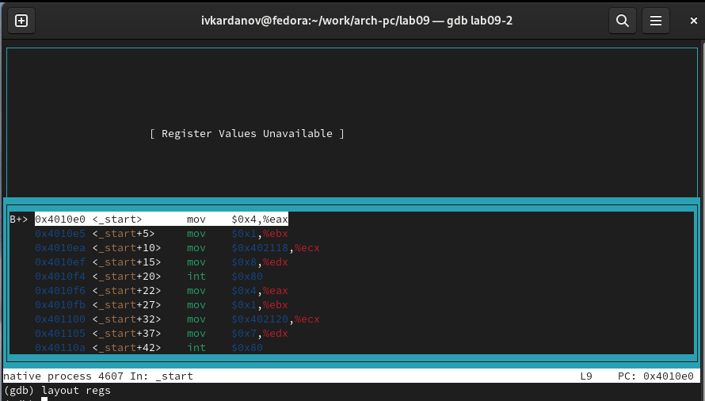{#fig:012 width=70%}

 Проверяю точки останова. (рис. @fig:013).
  
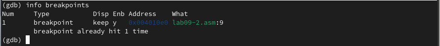{#fig:013 width=70%}

 Устанавливаю точку останова в последней инструкции. (рис. @fig:014).
 
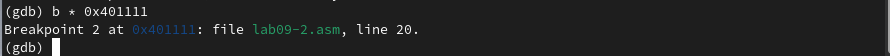{#fig:014 width=70%}

 Опять же, смотрю информацию обо всех установленных точках останова. (рис. @fig:015).
 
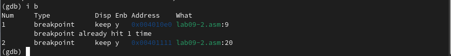{#fig:015 width=70%}
 
 Вручную изменяю значений регистров и переменных c помощью инструкции si. (рис. @fig:016).
 
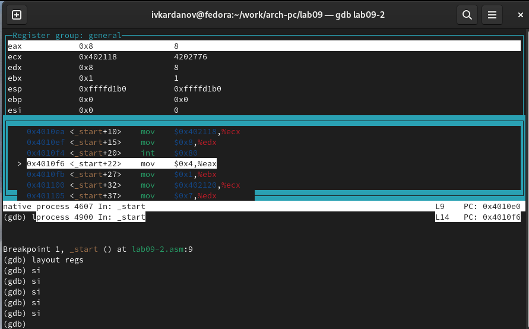{#fig:016 width=70%}

 Выполняю 5 инструкций si, и последовательно замечанию изменение значений регистров на экране соответственно. (рис. @fig:017).
 
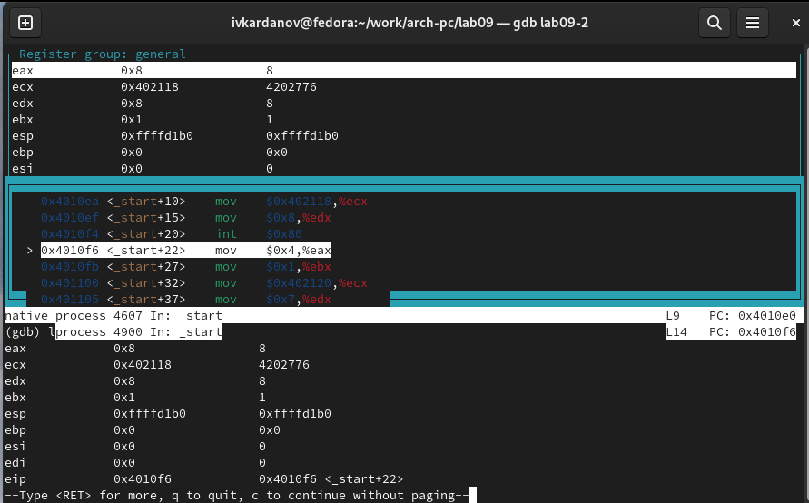{#fig:017 width=70%}

 Просматриваю содержимое регистров. (рис. @fig:018).
 
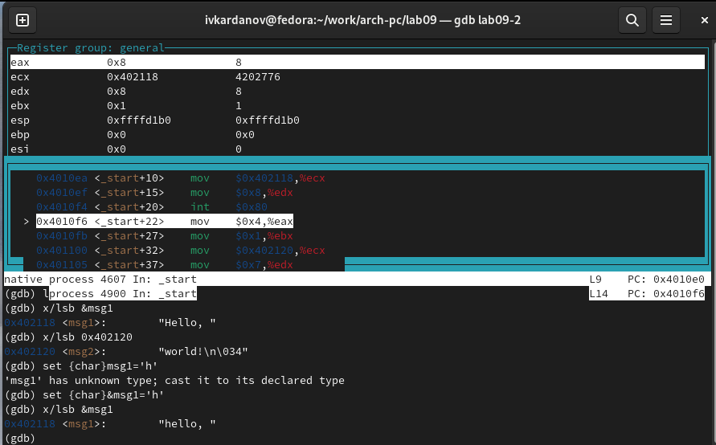{#fig:018 width=70%}

 Затем я просматриваю содержимое переменной msg1 и изменяю в ней символ с помощью команды {char}. (рис. @fig:019).
 
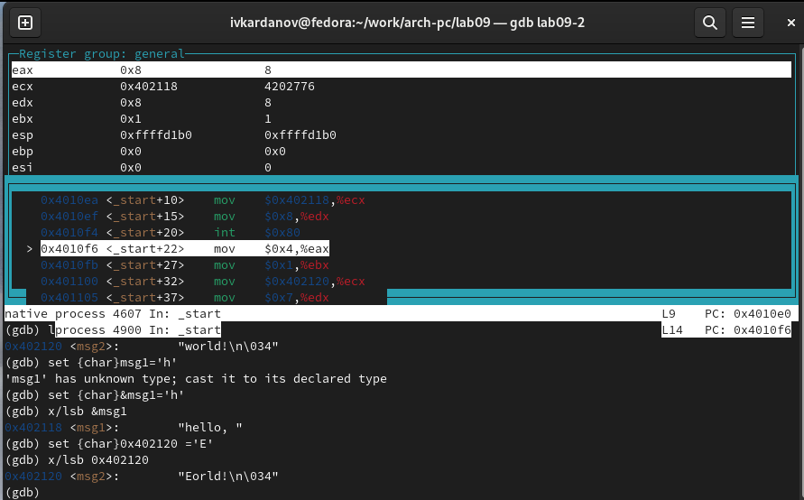{#fig:019 width=70%}

 Аналогичные действия проделываю с переменной msg2. (рис. @fig:020).
 
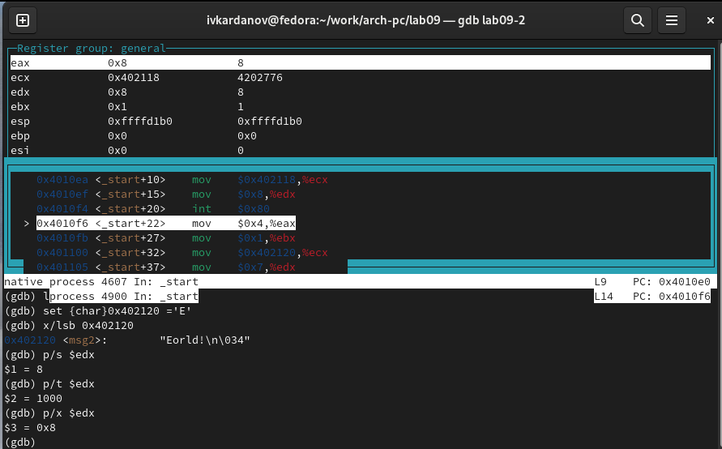{#fig:020 width=70%}

 Ввожу в различных форматах значение регистра edx. (рис. @fig:021).

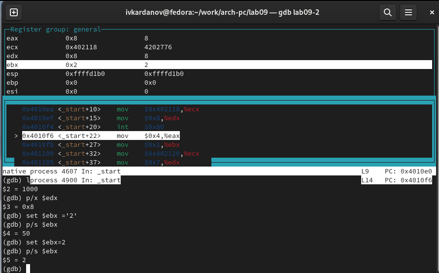{#fig:021 width=70%}

 Изменяю значение регистра ebx с помощью команды set. (рис. @fig:022).
 
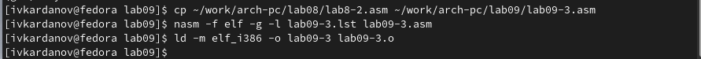{#fig:022 width=70%}

 Разница в выводе команд объяняется в значении: при бескавычном значении 2, мы её и получаем в итоге, а в другом случае переменная воспринимается иначе, и на выходе мы видим значение 50.

 Завершаю выполнение программы с помощью continue и выхожу из gdb с помощью quit. 
 
 Копирую файл lab8-2.asm, полученный во время выполнения лабораторной работы №8, содержащий программу для вывода аргументов командной строки. Затем создаю исполняемый файл. (рис. @fig:023).
 
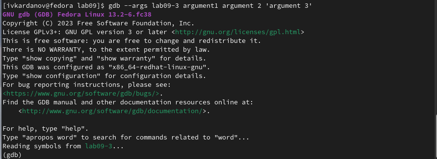{#fig:023 width=70%}

 Загружаю исполняемый файл в отладчик, указав нужные аргументы. (рис. @fig:024).
 
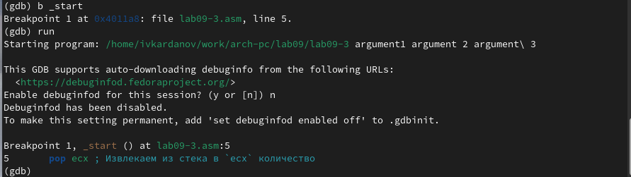{#fig:024 width=70%}

 Устанавливаю точку останова перед первой инструкцией и запускаю программу. (рис. @fig:025).
 
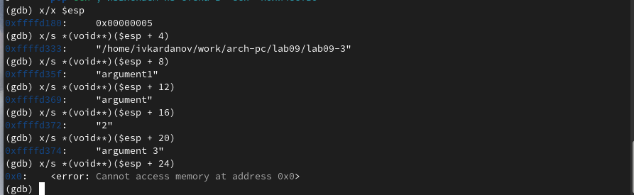{#fig:025 width=70%}

 Далее просматриваю позиции стека. (рис. @fig:026).
 
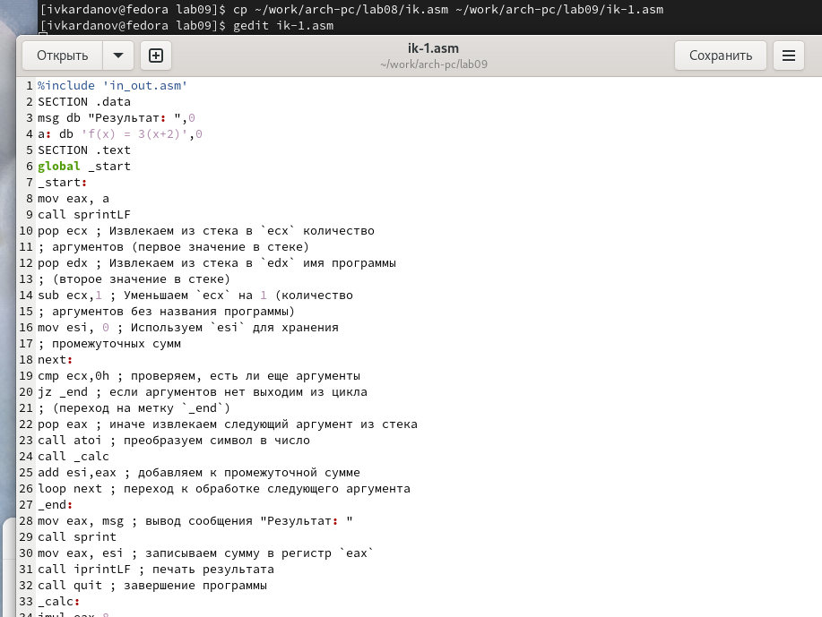{#fig:026 width=70%}

 Шаг изменения равен 4, т.к. каждый следующий адрес на стеке находится на расстоянии в 4 байта от предыдущего.

 4.3) Выполнение заданий для самостоятельной работы

 Копирую файл задания для самостоятельной работы, и реализую вычисление значения функции через подпрограмму. (рис. @fig:027).

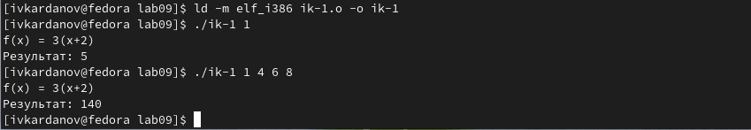{#fig:027 width=70%}

 Создаю исполняемый файл и убеждаюсь в правильности работы программы. (рис. @fig:028).

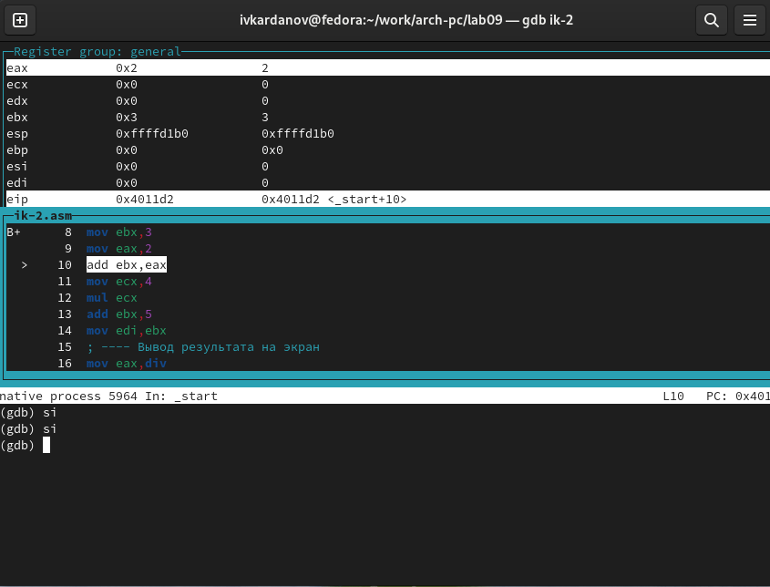{#fig:028 width=70%}

 Создаю файл ik-2.asm и вношу в него программу из последнего листинга. При запуске программа дает неверный результат, и дабы исправить эту ситуацию, нужно проанализировать изменения значений регистров, что я и сделал. Благодаря этому мне удалось вычислить ошибку и исправить её в тексте программы. (рис. @fig:029).
 
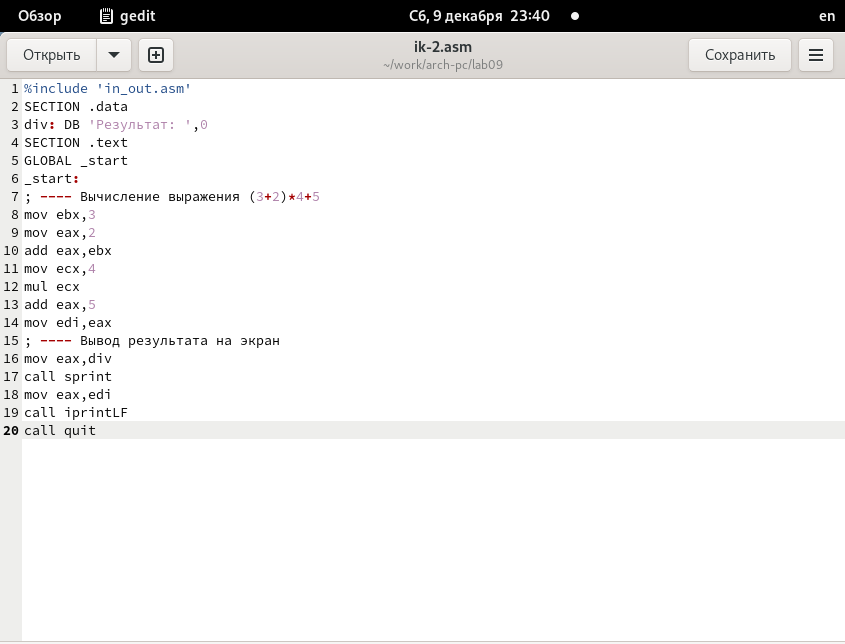{#fig:030 width=70%}

Создаю исполняемый файл, и, выполнив устную проверку, убеждаемся в правильности работы программы. (рис. @fig:030).

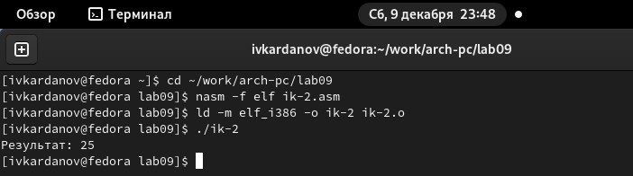{#fig:031 width=70%}

 Листинг 4.1 - Преобразованная программа из лабораторной работы №8.
 
 
 
 
```%include 'in_out.asm'

SECTION .data

msg db "Результат: ",0

a: db 'f(x) = 3(x+2)',0

SECTION .text

global _start

_start:

mov eax, a

call sprintLF

pop ecx ; Извлекаем из стека в `ecx` количество

; аргументов (первое значение в стеке)

pop edx ; Извлекаем из стека в `edx` имя программы

; (второе значение в стеке)

sub ecx,1 ; Уменьшаем `ecx` на 1 (количествo

; аргументов без названия программы)

mov esi, 0 ; Используем `esi` для хранения

; промежуточных сумм

next:

cmp ecx,0h ; проверяем, есть ли еще аргументы

jz _end ; если аргументов нет выходим из цикла

; (переход на метку `_end`)

pop eax ; иначе извлекаем следующий аргумент из стека

call atoi ; преобразуем символ в число

call _calc

add esi,eax ; добавляем к промежуточной сумме

loop next ; переход к обработке следующего аргумента

_end:

mov eax, msg ; вывод сообщения "Результат: "

call sprint

mov eax, esi ; записываем сумму в регистр `eax`

call iprintLF ; печать результата

call quit ; завершение программы

_calc:

imul eax,8

add eax,-3

ret
```
Листинг 4.2 - Исправленная программа для вычисления значения выражения.


```%include 'in_out.asm'

SECTION .data

div: DB 'Результат: ',0

SECTION .text

GLOBAL _start

_start:

; ---- Вычисление выражения (3+2)*4+5

mov ebx,3

mov eax,2

add eax,ebx

mov ecx,4

mul ecx

add eax,5

mov edi,eax

; ---- Вывод результата на экран

mov eax,div

call sprint

mov eax,edi

call iprintLF

call quit
```

# Выводы

 При выполнении лабораторной работы я приобрел практический опыт в написании программ в написании программ с использованием подпрограмм, а также ознакомился с методами отладки при помощи gdb и его основными возможностями.

 
# Список литературы{.unnumbered}

[Архитектура компьютера и ЭВМ](https://esystem.rudn.ru/pluginfile.php/2089096/mod_resource/content/0/Лабораторная%20работа%20№9.%20Понятие%20подпрограммы.%20Отладчик%20..pdf)
