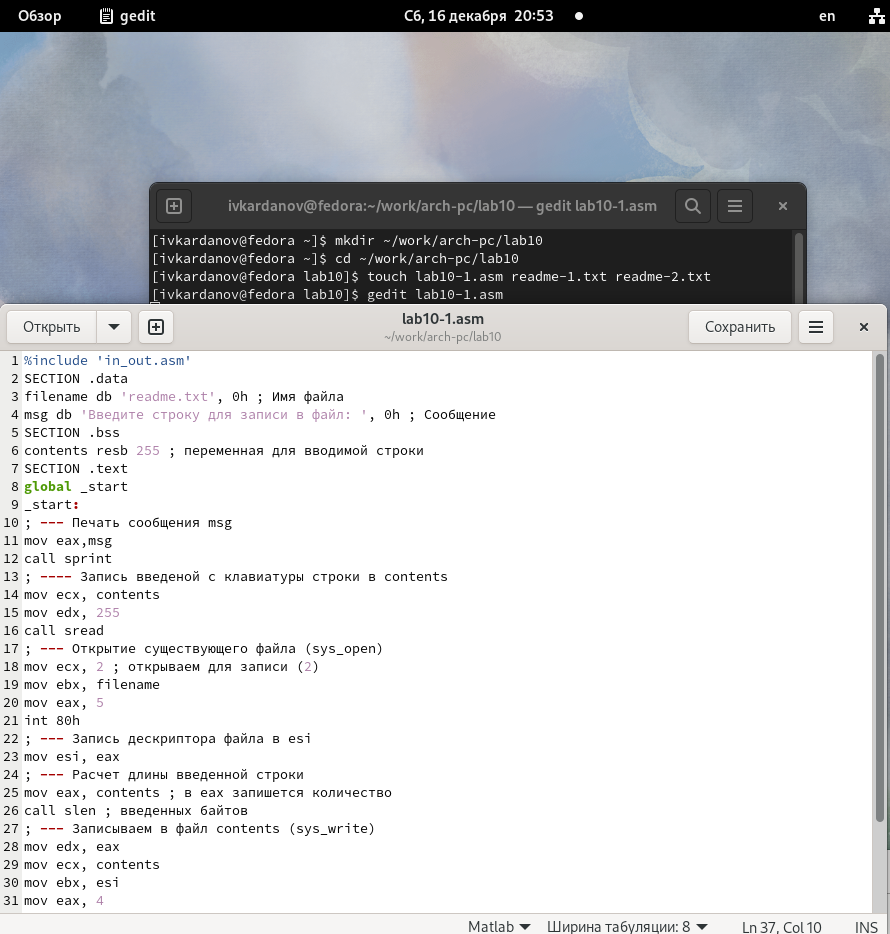
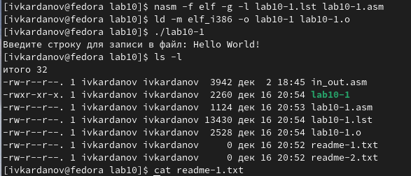
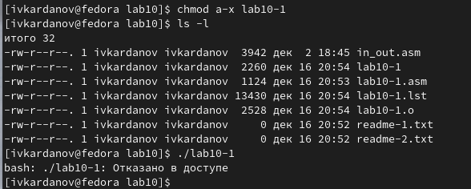
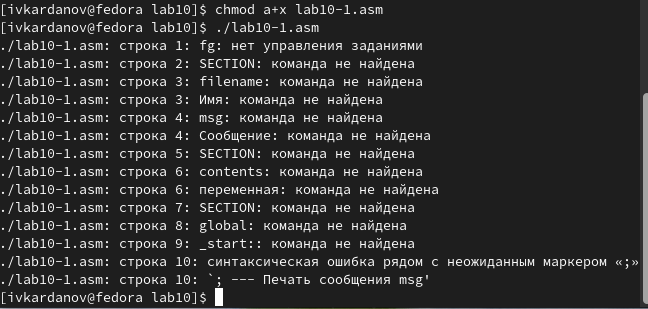
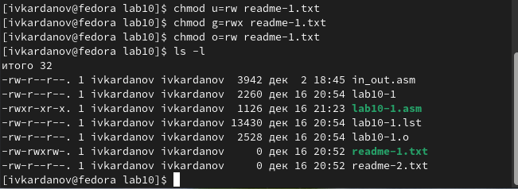
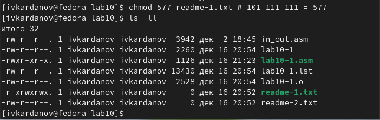
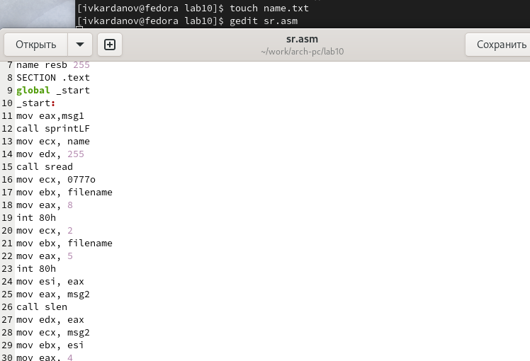
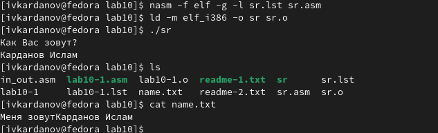

---
## Front matter
title: "Отчёт по лабораторной работе №10"
subtitle: "Дисциплина: Архитектура Компьютера"
author: "Ислам Карданов Вячеславович"

## Generic otions
lang: ru-RU
toc-title: "Содержание"

## Bibliography
bibliography: bib/cite.bib
csl: pandoc/csl/gost-r-7-0-5-2008-numeric.csl

## Pdf output format
toc: true # Table of contents
toc-depth: 2
lof: true # List of figures

fontsize: 12pt
linestretch: 1.5
papersize: a4
documentclass: scrreprt
## I18n polyglossia
polyglossia-lang:
  name: russian
  options:
	- spelling=modern
	- babelshorthands=true
polyglossia-otherlangs:
  name: english
## I18n babel
babel-lang: russian
babel-otherlangs: english
## Fonts
mainfont: PT Serif
romanfont: PT Serif
sansfont: PT Sans
monofont: PT Mono
mainfontoptions: Ligatures=TeX
romanfontoptions: Ligatures=TeX
sansfontoptions: Ligatures=TeX,Scale=MatchLowercase
monofontoptions: Scale=MatchLowercase,Scale=0.9
## Biblatex
biblatex: true
biblio-style: "gost-numeric"
biblatexoptions:
  - parentracker=true
  - backend=biber
  - hyperref=auto
  - language=auto
  - autolang=other*
  - citestyle=gost-numeric
## Pandoc-crossref LaTeX customization
figureTitle: "Рис."
tableTitle: "Таблица"
listingTitle: "Листинг"
lofTitle: "Список иллюстраций"

lolTitle: "Листинги"
## Misc options
indent: true
header-includes:
  - \usepackage{indentfirst}
  - \usepackage{float} # keep figures where there are in the text
  - \floatplacement{figure}{H} # keep figures where there are in the text
---

# Цель работы

Целью данной работы является приобретение практического опыта в написании программ для работы с файлами.

# Задание

	1. Работа с файлами средствами NASM.
	2. Выполнение заданий для самостоятельной работы
	
# Теоретическое введение

 ОС GNU/Linux является многопользовательской операционной системой. И для обеспечения защиты данных одного пользователя от действий других пользователей существуют специальные механизмы разграничения доступа к файлам. Кроме ограничения доступа, данный механизм позволяет разрешить другим пользователям доступ данным для совместной
работы. Права доступа определяют набор действий (чтение, запись, выполнение), разрешённых для выполнения пользователям системы над файлами. Для каждого файла пользователь может входить в одну из трех групп:

владелец, член группы владельца, все остальные. 

Для каждой из этих групп может быть установлен свой набор прав доступа. Владельцем файла является его создатель. Набор прав доступа задается тройками битов и состоит из прав на чтение, запись и исполнение файла. В символьном представлении он имеет вид строк rwx, где вместо любого символа может стоять дефис.  Буква означает наличие права (установлен в единицу второй бит триады r — чтение, первый бит w — запись, нулевой бит х — исполнение), а дефис означает отсутствие права (нулевое значение соответствующего бита). Также права доступа могут быть представлены как восьмеричное число. Так, права доступа rw- (чтение и запись, без исполнения) понимаются как три двоичные цифры 110 или как восьмеричная цифра 6. Тип файла определяется первой позицией, это может быть: каталог — d, обычный файл — дефис (-) или символьная ссылка на другой файл — l. Следующие 3 набора по 3 символа определяют конкретные права для конкретных групп: r — разрешено чтение файла, w — разрешена запись в файл; x — разрешено исполнение файл и дефис (-) — право не дано. 

Для изменения прав доступа служит команда chmod, которая понимает как символьное, так и числовое указание прав. Для того чтобы назначить файлу /home/debugger/README права rw-r, то есть разрешить владельцу чтение и запись, группе только чтение, остальным пользователям — ничего. B  символьном представлении есть возможность явно указывать какой группе какие права необходимо добавить, отнять или присвоить. В операционной системе Linux существуют различные методы управления файлами, например, такие как создание и открытие файла, только для чтения или для чтения и записи, добавления в существующий файл, закрытия и удаления файла, предоставление прав доступа. Обработка файлов в операционной системе Linux осуществляется за счет использования определенных системных вызовов. Для корректной работы и доступа к файлу при его открытии или создании, файлу присваивается уникальный номер (16-битное целое число) – дескриптор файла. Для создания и открытия файла служит системный вызов sys_creat, который использует следующие аргументы: права доступа к файлу в регистре ECX, имя файла в EBX и номер системного вызова sys_creat (8) в EAX. Для открытия существующего файла служит системный вызов sys_open, который использует следующие аргументы: права доступа к файлу в регистре EDX, режим доступа к файлу в регистр ECX, имя файла в EBX и номер системного вызова sys_open (5) в EAX. Для записи в файл служит системный вызов sys_write, который использует следующие аргументы: количество байтов для записи в регистре EDX, строку содержимого для записи ECX, файловый дескриптор в EBX и номер системного вызова sys_write (4) в EAX.

Системный вызов возвращает фактическое количество записанных байтов в регистр EAX. В случае ошибки, код ошибки также будет находиться в регистре EAX. прежде чем записывать в файл, его необходимо создать или открыть, что позволит получить дескриптор файла.

# Выполнение лабораторной работы
 
 4.1) Работа с файлами средствами NASM.
 
 С помощью утилиты mkdir создаю директорию lab10 для выполнения лабораторной работы. Перехожу в созданный каталог с помощью утилиты cd. С помощью touch создаю файл lab10-1.asm. Открываю созданный файл lab8-1.asm, вставляю в него следующую программу: (рис. @fig:001).

{#fig:001 width=70%}

  Создаю исполняемый файл, проверяю его работу. (рис. @fig:002).

{#fig:002 width=70%}

 С помощью команды chmod а-х изменяю права доступа к файлу, запретив его выполнение, что и проверяю соответственно. (рис. @fig:003).
 
{#fig:003 width=70%}
 
 Файл не исполняется. Затем я с помощью команды chmod a+x добавляю права на исполнение файла lab10-1.asm и пытаюсь выполнить его.  (рис. @fig:004).

{#fig:004 width=70%}
 
 Текстовый файл начинает работу, но не исполняется, т.к. не содержит в себе команд для терминала. Затем в соответствии со своим 7-м вариантом изменяю права доступа к файлу readme-1.txt согласно таблице. Потом проверяю правильность выполнение команды с помощью ls -l. (рис. @fig:005).
 
{#fig:005 width=70%}

 Аналогично поступаю с  файлом readme-2.txt, только уже в числовом виде. (рис. @fig:006).

{#fig:006 width=70%}

 4.2) Выполнение заданий для самостоятельной работы.

 Создаю файлы sr.asm и name.txt для корректной работы программы записи моего имени, введенного с клавиатуры, в соответвующий файл. Далее пишу непосредственно сам код: (рис. @fig:007).
 
{#fig:007 width=70%}
 
 Создаю исполняемый файл, проверяю его работу, далее ввожу необходимые команды, и убеждаюсь в правильности работы программы. (рис. @fig:008).
 
{#fig:008 width=70%}

 Листинг 4.1 - Программа, приглашающая написать имя, и записывающая его в файл.
 
 
 
```%include ‘in_out.asm’

SECTION .data

msg1 db ‘Как Вас зовут?’, 0h

filename db ‘name.txt’, 0h

msg2 db ‘Меня зовут’, 0h

SECTION .bss

name resb 255

SECTION .text

global _start

_start:

mov eax,msg1

call sprintLF

mov ecx, name

mov edx, 255

call sread

mov ecx, 0777o

mov ebx, filename

mov eax, 8

int 80h

mov ecx, 2

mov ebx, filename

mov eax, 5

int 80h

mov esi, eax

mov eax, msg2

call slen

mov edx, eax

mov ecx, msg2

mov ebx, esi

mov eax, 4

int 80h

mov eax, name

call slen

mov edx, eax

mov ecx, name

mov ebx, esi

mov eax, 4

int 80h

mov ebx, esi

mov eax, 6

int 80h

call quit
```


# Выводы

 При выполнении лабораторной работы я приобрел практический опыт в написании программ с использованием циклов и обработкой аргументов командной строки.
 
# Список литературы{.unnumbered}

[Архитектура компьютера и ЭВМ](https://esystem.rudn.ru/pluginfile.php/2089097/mod_resource/content/0/Лабораторная%20работа%20№10.%20Работа%20с%20файлами%20средствами%20Nasm.pdf)
